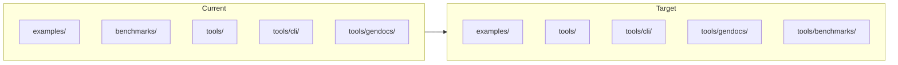

# Benchmarks, Tools, Examples & Build Refactor

## Current state

- **Examples**: 22 entries in [build/targets.zig](build/targets.zig) (`example_targets`), built from `examples/*.zig`. Step `examples` only **builds**; each example has a separate run step (`run-hello`, `run-llm`, etc.).
- **Benchmarks**: 2 entries in `benchmark_targets` pointing at `benchmarks/main.zig` and `benchmarks/run_competitive.zig` at repo root. Steps `benchmarks` and `bench-competitive` **run** those executables; `bench-all` runs both. The `benchmarks/` tree is large (system/, infrastructure/, domain/, core/, competitive/, baselines/).
- **CLI**: `tools/cli/`; `abi bench` runs in-process benchmarks in [tools/cli/commands/bench.zig](tools/cli/commands/bench.zig) and is independent of the standalone `zig build benchmarks` harness.
- **Feature module**: [src/features/benchmarks/](src/features/benchmarks/mod.zig) provides `abi.benchmarks` (Context, Config, `isEnabled()`) and stays as-is.

Inconsistencies:

- Examples live in `examples/`, benchmark harness in `benchmarks/` at root; CLI and gendocs live under `tools/`.
- Step semantics: `examples` = build-only; `benchmarks` / `bench-competitive` / `bench-all` = run.
- No single “build benchmark executables only” step (parallel to “examples”).
- Baseline paths are hardcoded as `"benchmarks/baselines"` in [benchmarks/system/baseline_store.zig](benchmarks/system/baseline_store.zig) and docs.

## Target state

1. **Location**: Move the whole `benchmarks/` directory to `tools/benchmarks/` so all runnable harnesses (CLI, gendocs, benchmark suite) live under `tools/`. Step names remain `benchmarks`, `bench-competitive`, `bench-all` for backward compatibility.
2. **Build steps**: Unify pattern for examples vs benchmarks:

- **examples**: keep `examples` = build all; keep per-example `run-<name>` steps.
- **benchmarks**: add `build-benchmarks` = build both benchmark executables (no run); keep `benchmarks`, `bench-competitive`, and `bench-all` as run steps. Optionally document that `bench-all` = run both.

1. **Structure**: Keep two tables in [build/targets.zig](build/targets.zig) but use the same `BuildTarget` shape; set `source_path` for benchmark targets to `tools/benchmarks/main.zig` and `tools/benchmarks/run_competitive.zig` after the move. Ensure `buildTargets()` is called so that:

- For examples: aggregate step `examples` depends on build (compile) only.
- For benchmarks: aggregate step `bench-all` depends on run; new `build-benchmarks` step depends on compile only.

1. **Paths and docs**: Update all references from `benchmarks/` to `tools/benchmarks/` (build, docs, baseline defaults). Prefer a default baseline path that is relative to CWD or configurable (e.g. `tools/benchmarks/baselines` or env `ABI_BENCH_BASELINES`) so CI and local use keep working after the move.

## Implementation plan

### 1. Move `benchmarks/` to `tools/benchmarks/`

- Move directory: `benchmarks/` → `tools/benchmarks/` (all contents: main.zig, mod.zig, run.zig, run_competitive.zig, core/, domain/, infrastructure/, system/, competitive/, baselines/, README.md, STRUCTURE.md).
- No changes to imports inside the benchmark tree if they use relative paths (e.g. `@import("system/framework.zig")`); they stay valid under `tools/benchmarks/`.

### 2. Update build system

- **[build/targets.zig](build/targets.zig)**  
  - In `benchmark_targets`, set `source_path` to `tools/benchmarks/main.zig` and `tools/benchmarks/run_competitive.zig`.
- **[build.zig](build.zig)**  
  - Add a step `build-benchmarks` that depends only on compiling the two benchmark executables (reuse the same loop as today but depend on `exe.step` for those two, not `run.step`). Option: add a `buildTargets(..., aggregate_runs = false)` call for benchmark_targets into a new step `build-benchmarks`, and keep the existing call that feeds `bench_all_step` with `aggregate_runs = true` so `bench-all` still runs both. So: two usages of benchmark_targets — one for build-benchmarks (build only), one for bench-all (run). That would duplicate the loop. Cleaner: in `buildTargets`, support an optional “build-only” aggregate step so one call can add both “build” and “run” deps; or add a small helper that only builds benchmark exes and have `build-benchmarks` depend on that. Simplest: add `build-benchmarks` step that depends on the compile steps of the two benchmark executables (duplicate the for-loop for benchmark_targets in build.zig that only adds exe.step to build-benchmarks), or factor `buildTargets` to accept an optional second aggregate for “build only”. Recommendation: in build.zig, after the existing `bench_all_step` block, add a step `build-benchmarks` and in the same loop that currently builds benchmark exes (inside `buildTargets`), also register each exe’s step with `build-benchmarks`. Easiest: add a second loop in build.zig that builds the same two executables and only adds their compile step to `build-benchmarks`. That duplicates logic. Better: extend `buildTargets` to take an optional `build_only_aggregate: ?*std.Build.Step`; when non-null, add each exe.step to it. Then call `buildTargets(..., bench_all_step, true, build_benchmarks_step)` for benchmark_targets and `buildTargets(..., examples_step, false, null)` for examples.
- **verify-all**: Keep depending on `bench_all_step` (and optionally on `build-benchmarks` if we want verify-all to ensure benchmarks compile; today it already runs them, so no change required).

### 3. Baseline and path references

- **Default baseline path**: In [benchmarks/system/baseline_store.zig](benchmarks/system/baseline_store.zig) (after move: [tools/benchmarks/system/baseline_store.zig](tools/benchmarks/system/baseline_store.zig)), the default in doc comments and the test is `"benchmarks/baselines"`. Change to `"tools/benchmarks/baselines"` (or resolve at runtime from executable path / CWD so it works from any cwd). Prefer a single default string `"tools/benchmarks/baselines"` and update the test expectations in that file.
- **References in docs**: Update [benchmarks/README.md](benchmarks/README.md), [benchmarks/STRUCTURE.md](benchmarks/STRUCTURE.md), [benchmarks/baselines/README.md](benchmarks/baselines/README.md), and [benchmarks/system/baseline_comparator.zig](benchmarks/system/baseline_comparator.zig) (and any other references under the moved tree) from `benchmarks/` to `tools/benchmarks/` where they describe paths or usage. Update [tools/README.md](tools/README.md), [CLAUDE.md](CLAUDE.md), [AGENTS.md](AGENTS.md), and [src/features/observability/README.md](src/features/observability/README.md) to point at `tools/benchmarks/` and keep step names unchanged (`zig build benchmarks`, `zig build bench-all`).
- **docs/plan.md, docs/roadmap.md, docs/plans/*.md**: Replace `benchmarks/` with `tools/benchmarks/` in paths.

### 4. Optional: unify “build” vs “run” semantics

- **Examples**: Leave as-is (step `examples` = build; run via `run-<name>`).
- **Benchmarks**: Document in CLAUDE.md that `build-benchmarks` builds the benchmark executables and `benchmarks` / `bench-all` run them. No change to existing step names so scripts and docs that use `zig build benchmarks` or `zig build bench-all` keep working.

### 5. Validation

- Run `zig build build-benchmarks`, `zig build benchmarks`, `zig build bench-competitive`, `zig build bench-all` and ensure they succeed from repo root.
- Run `zig build examples` and one `zig build run-hello` (or equivalent).
- Run `zig build verify-all` and confirm it still passes (examples + bench-all).
- Run `zig build full-check` and any CI that uses these steps.
- If anything uses `pathExists(b, "benchmarks/main.zig")`, update to `tools/benchmarks/main.zig` (currently targets.zig uses pathExists only for example_targets and benchmark_targets; after the move, paths are in the table).

## Summary of file touch list

| Area                                                                                                                                                             | Action                                                                                                                                     |
| ---------------------------------------------------------------------------------------------------------------------------------------------------------------- | ------------------------------------------------------------------------------------------------------------------------------------------ |
| Repo layout                                                                                                                                                      | Move `benchmarks/` → `tools/benchmarks/`                                                                                                   |
| [build/targets.zig](build/targets.zig)                                                                                                                           | Update `benchmark_targets[].source_path` to `tools/benchmarks/main.zig` and `tools/benchmarks/run_competitive.zig`                         |
| [build.zig](build.zig)                                                                                                                                           | Add `build-benchmarks` step (depend on compile-only of benchmark exes); optionally extend `buildTargets` to support a build-only aggregate |
| [tools/benchmarks/system/baseline_store.zig](tools/benchmarks/system/baseline_store.zig)                                                                         | Default path and test expectations: `benchmarks/baselines` → `tools/benchmarks/baselines`                                                  |
| [tools/benchmarks/README.md](tools/benchmarks/README.md), STRUCTURE.md, baselines/README.md, system/baseline_comparator.zig                                      | Path and usage text: `benchmarks/` → `tools/benchmarks/`                                                                                   |
| [CLAUDE.md](CLAUDE.md), [AGENTS.md](AGENTS.md), [tools/README.md](tools/README.md), [src/features/observability/README.md](src/features/observability/README.md) | Update benchmark directory and step docs                                                                                                   |
| docs/plan.md, docs/roadmap.md, docs/plans/*.md                                                                                                                   | Path updates to `tools/benchmarks/`                                                                                                        |

## Diagram (current vs target layout)

Step naming remains: `examples`, `run-*`, `benchmarks`, `bench-competitive`, `bench-all`; add `build-benchmarks` for symmetry with build-only benchmark artifacts.
