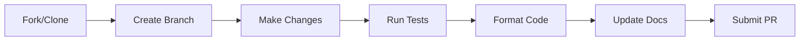

# Contributing
> **Codebase Status:** Synced with repository as of 2026-01-23.

<p align="center">
  
  
  
</p>

<p align="center">
  Thanks for helping improve ABI! Keep changes focused, documented, and tested.
</p>

---

> **Before You Start**: Please review the [Architecture Documentation](docs/intro.md) to understand the system design.

## Quick Reference

| Task | Command |
|------|---------|
| Clone | `git clone https://github.com/donaldfilimon/abi.git && cd abi` |
| Build | `zig build` |
| Test | `zig build test --summary all` |
| Format | `zig fmt .` |
| Single File Test | `zig test src/path/to/file.zig` |

## Workflow



| Step | Action | Command/Details |
|------|--------|-----------------|
| 1 | Create branch | `git checkout -b feature/my-feature` |
| 2 | Make changes | Keep scope focused |
| 3 | Build & test | `zig build && zig build test` |
| 4 | Format | `zig fmt .` |
| 5 | Update docs | For public API changes |

## Style Guide

| Rule | Example | Status |
|------|---------|--------|
| Indentation | 4 spaces, no tabs |  |
| Line length | Under 100 characters |  |
| Types | `PascalCase` |  |
| Functions/Variables | `camelCase` |  |
| Imports | Explicit only (no `usingnamespace`) |  |
| Error handling | `!` return types, specific error enums |  |
| Cleanup | Prefer `defer`/`errdefer` |  |

## Zig 0.16 Conventions

### Memory Management

- **Prefer `std.ArrayListUnmanaged` over `std.ArrayList`**
  - Unmanaged requires passing allocator explicitly to methods
  - Provides better control over memory ownership
  - Reduces hidden allocator dependencies

```zig
// Good
var list = std.ArrayListUnmanaged(u8).empty;
try list.append(allocator, item);
list.deinit(allocator);

// Avoid
var list = std.ArrayList(u8).init(allocator);
try list.append(item);
list.deinit();
```

### Formatting and I/O

- **Use modern format specifiers** instead of manual conversions:
  - `{t}` for enum and error values (replaces `@tagName()`)
  - `{B}` / `{Bi}` for byte sizes
  - `{D}` for durations
  - `{b64}` for base64 encoding

```zig
// Good
std.debug.print("Status: {t}\n", .{status});

// Avoid
std.debug.print("Status: {s}\n", .{@tagName(status)});
```

### Error Handling

- Use specific error sets instead of `anyerror`
- Always document when errors can occur
- Use `errdefer` for cleanup on error paths

### Testing

| Test Type | Command | Notes |
|-----------|---------|-------|
| All tests | `zig build test --summary all` | Detailed output |
| Single file | `zig test src/runtime/engine/engine.zig` | Direct file test |
| Filtered | `zig test src/tests/mod.zig --test-filter "pattern"` | Pattern matching |
| With features | `zig build test -Denable-gpu=true` | Feature-gated |
| Skip hardware | Use `error.SkipZigTest` | For hardware-gated tests |

> **Note**: Unit coverage lives in library tests and `tests/mod.zig`. New features must include tests.

## Commits & Pull Requests

### Commit Message Format

```
<type>: <short summary>

[optional body]
[optional footer]
```

| Type | Description |
|------|-------------|
| `feat` | New feature |
| `fix` | Bug fix |
| `docs` | Documentation only |
| `refactor` | Code change (no feature/fix) |
| `test` | Adding tests |
| `chore` | Maintenance |

### PR Checklist

- [ ] Clear description of changes
- [ ] Linked issues (if applicable)
- [ ] Tests pass (`zig build test`)
- [ ] Code formatted (`zig fmt .`)
- [ ] Docs updated for API changes

## For AI Agents

<details>
<summary><strong>AI-Specific Guidelines</strong></summary>

| Rule | Description |
|------|-------------|
| Minimal changes | Keep changes focused and consistent with existing patterns |
| API stability | Avoid breaking public APIs unless explicitly requested |
| Feature gating | Stub modules must mirror real APIs and return `error.*Disabled` |
| Documentation | See [CLAUDE.md](CLAUDE.md) for comprehensive guidance |

</details>

---

<p align="center">
  <a href="README.md">← Back to README</a> •
  <a href="CLAUDE.md">Development Guide →</a>
</p>

