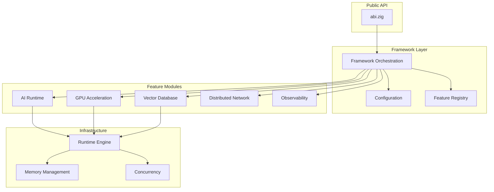

<div align="center">

# ABI Framework


<br/>


<br/><br/>

**A modern Zig 0.16 framework for AI services, vector search, and high-performance systems**

[Quick Start](#-quick-start) · [Documentation](https://donaldfilimon.github.io/abi/) · [Examples](#-examples) · [Contributing](CONTRIBUTING.md)

<br/>

```
    ╔═══════════════════════════════════════════════════════════════╗
    ║   LLM Inference  ·  Vector Database  ·  GPU Acceleration      ║
    ║   Agent Runtime  ·  Distributed Compute  ·  Training Pipelines║
    ╚═══════════════════════════════════════════════════════════════╝
```

</div>

## Why ABI?

<table>
<tr>
<td width="33%" valign="top">

### Lightning Fast
Built with Zig for zero-cost abstractions, comptime optimization, and bare-metal performance. SIMD-accelerated operations throughout.

</td>
<td width="33%" valign="top">

### Production Ready
Battle-tested with 787+ tests, comprehensive error handling, graceful degradation, and circuit breakers for resilience.

</td>
<td width="33%" valign="top">

### Fully Modular
Enable only what you need. Every feature is toggleable at compile-time with zero overhead for disabled modules.

</td>
</tr>
</table>

---

## Highlights

| Feature | Description | Status |
|:--------|:------------|:------:|
| **AI Runtime** | LLM inference with Llama-CPP parity, agent runtime, training pipelines |  |
| **Vector Database** | WDBX with HNSW/IVF-PQ indexing, hybrid search, real-time analytics |  |
| **GPU Acceleration** | CUDA, Vulkan, Metal (Accelerate/AMX), WebGPU, FPGA with unified API |  |
| **Compute Engine** | Work-stealing scheduler, NUMA-aware, lock-free primitives |  |
| **Distributed Network** | Raft consensus, node discovery, load balancing |  |
| **Observability** | Metrics, tracing, profiling, circuit breakers |  |
| **Interactive CLI** | TUI launcher, GPU dashboard, training monitor |  |
| **Streaming API** | SSE/WebSocket inference, circuit breakers, session recovery |  |

---

## Quick Start

### Installation

```bash
git clone https://github.com/donaldfilimon/abi.git
cd abi
zig build
zig build run -- --help
```

### Requirements

| Dependency | Version | Required |
|:-----------|:--------|:--------:|
| Zig | 0.16.x | Yes |
| Git | Any | Yes |
| GPU Drivers | Latest | Optional |

### Hello World

```zig
const std = @import("std");
const abi = @import("abi");

pub fn main() !void {
    var gpa = std.heap.GeneralPurposeAllocator(.{}){};
    defer _ = gpa.deinit();
    const allocator = gpa.allocator();

    // Initialize with builder pattern
    const config = abi.Config.init()
        .withAI(true)
        .withGPU(true)
        .withDatabase(true);

    var framework = try abi.Framework.init(allocator, config);
    defer framework.deinit();

    std.debug.print("ABI v{s} ready!\n", .{abi.version()});
}
```

---

## Examples

<details open>
<summary><b>AI Agent Chat</b></summary>

```zig
const abi = @import("abi");

pub fn main() !void {
    var gpa = std.heap.GeneralPurposeAllocator(.{}){};
    const allocator = gpa.allocator();
    defer _ = gpa.deinit();

    var agent = try abi.ai.Agent.init(allocator, .{
        .name = "assistant",
        .temperature = 0.7,
        .enable_history = true,
    });
    defer agent.deinit();

    const response = try agent.chat("Explain Zig's comptime in one sentence.", allocator);
    defer allocator.free(response);

    std.debug.print("Agent: {s}\n", .{response});
}
```

</details>

<details>
<summary><b>Vector Database</b></summary>

```zig
const abi = @import("abi");

pub fn main() !void {
    var gpa = std.heap.GeneralPurposeAllocator(.{}){};
    const allocator = gpa.allocator();
    defer _ = gpa.deinit();

    // Create a 384-dimensional vector database
    var db = try abi.wdbx.createDatabase(allocator, .{ .dimension = 384 });
    defer db.deinit();

    // Insert vectors
    try db.insertVector(1, &embedding1);
    try db.insertVector(2, &embedding2);

    // Search for similar vectors
    const results = try db.searchVectors(&query_embedding, 10);
    defer allocator.free(results);

    for (results) |result| {
        std.debug.print("ID: {d}, Score: {d:.4}\n", .{ result.id, result.score });
    }
}
```

</details>

<details>
<summary><b>GPU-Accelerated Compute</b></summary>

```zig
const abi = @import("abi");

pub fn main() !void {
    var gpa = std.heap.GeneralPurposeAllocator(.{}){};
    const allocator = gpa.allocator();
    defer _ = gpa.deinit();

    // Auto-selects best available backend (CUDA > Vulkan > Metal > CPU)
    var gpu = try abi.Gpu.init(allocator, .{
        .enable_profiling = true,
        .memory_mode = .automatic,
    });
    defer gpu.deinit();

    const a = try gpu.createBufferFromSlice(f32, &[_]f32{ 1, 2, 3, 4 }, .{});
    const b = try gpu.createBufferFromSlice(f32, &[_]f32{ 4, 3, 2, 1 }, .{});
    const result = try gpu.createBuffer(4 * @sizeOf(f32), .{});
    defer { gpu.destroyBuffer(a); gpu.destroyBuffer(b); gpu.destroyBuffer(result); }

    // Executes on GPU with automatic SIMD/scalar fallback
    _ = try gpu.vectorAdd(a, b, result);

    var output: [4]f32 = undefined;
    try result.read(f32, &output);
    // output = { 5, 5, 5, 5 }
}
```

</details>

<details>
<summary><b>Training Pipeline</b></summary>

```zig
const abi = @import("abi");

pub fn main() !void {
    var gpa = std.heap.GeneralPurposeAllocator(.{}){};
    const allocator = gpa.allocator();
    defer _ = gpa.deinit();

    const config = abi.ai.TrainingConfig{
        .epochs = 10,
        .batch_size = 32,
        .learning_rate = 0.001,
        .optimizer = .adamw,
    };

    var result = try abi.ai.trainWithResult(allocator, config);
    defer result.deinit();

    std.debug.print("Final loss: {d:.6}\n", .{result.report.final_loss});
}
```

</details>

---

## CLI Reference

```bash
# Core Commands
abi --help                    # Show all commands
abi system-info               # System and feature status
abi tui                       # Interactive TUI launcher

# Database Operations
abi db stats                  # Database statistics
abi db add --id 1 --embed "text"
abi db search --embed "query" --top 5
abi db backup --path backup.db

# AI & Agents
abi agent                     # Interactive chat
abi agent --persona coder     # Use specific persona
abi agent -m "Hello"          # One-shot message
abi llm chat model.gguf       # Chat with local model

# GPU Management
abi gpu backends              # List available backends
abi gpu devices               # Enumerate all GPUs
abi gpu summary               # Quick status

# Training
abi train run --epochs 10     # Start training
abi train resume ./checkpoint # Resume from checkpoint
abi train monitor             # Real-time metrics

# Runtime Feature Flags
abi --list-features           # Show feature status
abi --enable-gpu db stats     # Enable feature for command
abi --disable-ai system-info  # Disable feature for command
```

---

## Performance

<div align="center">

| Benchmark | Operations/sec |
|:----------|---------------:|
| SIMD Vector Dot Product | **84,875,233** |
| SIMD Vector Addition | **84,709,869** |
| Configuration Loading | **66,476,102** |
| Memory Allocation (1KB) | **464,712** |
| Logging Operations | **331,960** |
| Compute Engine Task | **93,368** |
| Network Registry Ops | **84,831** |
| JSON Parse/Serialize | **83,371** |
| Database Vector Insert | **68,444** |
| Database Vector Search | **56,563** |

<sub>ReleaseFast build on typical development workstation. Run `zig build benchmarks` to test your system.</sub>

</div>

---

## Architecture

```
abi/
├── src/
│   ├── abi.zig           # Public API entry point
│   ├── config.zig        # Unified configuration
│   ├── framework.zig     # Lifecycle orchestration
│   ├── platform/         # Platform detection (OS, arch, CPU)
│   │
│   ├── ai/               # AI Module
│   │   ├── llm/          # Local LLM inference (Llama-CPP parity)
│   │   ├── agents/       # Agent runtime with personas
│   │   ├── training/     # Training pipelines
│   │   └── embeddings/   # Vector embeddings
│   │
│   ├── gpu/              # GPU Acceleration
│   │   ├── backends/     # CUDA, Vulkan, Metal, WebGPU, FPGA
│   │   ├── kernels/      # Compute kernels
│   │   └── dsl/          # Shader DSL & codegen
│   │
│   ├── database/         # Vector Database (WDBX)
│   │   ├── hnsw.zig      # HNSW indexing
│   │   └── distributed/  # Sharding & replication
│   │
│   ├── runtime/          # Compute Infrastructure
│   │   ├── engine/       # Work-stealing scheduler
│   │   ├── concurrency/  # Lock-free primitives
│   │   └── memory/       # Pool allocators
│   │
│   ├── network/          # Distributed Compute
│   │   └── raft/         # Consensus protocol
│   │
│   ├── shared/           # Shared utilities (security, io, utils)
│   │
│   └── observability/    # Metrics & Tracing
│
├── tools/cli/            # CLI implementation
├── examples/             # Usage examples
└── docs/                 # Documentation
```

<details>
<summary><b>System Architecture Diagram</b></summary>



</details>

---

## Feature Flags

All features are enabled by default. Disable unused features to reduce binary size.

| Flag | Default | Description |
|:-----|:-------:|:------------|
| `-Denable-ai` | true | AI features, agents, and connectors |
| `-Denable-llm` | true | Local LLM inference |
| `-Denable-gpu` | true | GPU acceleration |
| `-Denable-database` | true | Vector database (WDBX) |
| `-Denable-network` | true | Distributed compute |
| `-Denable-web` | true | HTTP client utilities |
| `-Denable-profiling` | true | Performance profiling |

### GPU Backend Selection

```bash
# Single backend
zig build -Dgpu-backend=vulkan
zig build -Dgpu-backend=cuda
zig build -Dgpu-backend=metal

# Multiple backends (comma-separated)
zig build -Dgpu-backend=cuda,vulkan

# Auto-detect best available
zig build -Dgpu-backend=auto
```

---

## C Bindings

Use ABI from C, Rust, Go, Python, or any language with C FFI:

```c
#include <abi.h>

int main() {
    abi_framework_t fw = NULL;
    abi_init(&fw);

    // SIMD operations
    float a[] = {1, 2, 3, 4}, b[] = {4, 3, 2, 1};
    float dot = abi_simd_vector_dot(a, b, 4);  // = 20

    // Vector database
    abi_database_t db = NULL;
    abi_database_config_t cfg = { "vectors", 384, 1000 };
    abi_database_create(&cfg, &db);
    abi_database_insert(db, 1, embedding, 384);

    abi_shutdown(fw);
    return 0;
}
```

Build: `cd bindings/c && zig build` produces:
- macOS: `libabi.dylib` / `libabi_static.a`
- Linux: `libabi.so` / `libabi_static.a`
- Windows: `abi.dll` / `abi_static.lib`

See [bindings/c/README.md](bindings/c/README.md) for full API reference.

---

## Documentation

| Resource | Description |
|:---------|:------------|
| [Online Docs](https://donaldfilimon.github.io/abi/) | Searchable documentation site |
| [C Bindings](bindings/c/README.md) | C FFI API reference |
| [API Reference](API_REFERENCE.md) | Public API summary |
| [Quickstart](QUICKSTART.md) | Getting started guide |
| [Deployment Guide](docs/deployment.md) | Production deployment |
| [AI Guide](docs/ai.md) | LLM, agents, training |
| [GPU Guide](docs/gpu.md) | Multi-backend GPU acceleration |
| [Database Guide](docs/database.md) | WDBX vector database |
| [Network Guide](docs/network.md) | Distributed compute |
| [Streaming Guide](docs/streaming.md) | SSE/WebSocket streaming |
| [Migration Guide](docs/migration/zig-0.16-migration.md) | Zig 0.16 patterns |
| [Troubleshooting](docs/troubleshooting.md) | Common issues |

```bash
# Run all tests
zig build test --summary all

# Test specific module
zig test src/runtime/engine/engine.zig

# Filter tests by pattern
zig test src/tests/mod.zig --test-filter "pattern"

# Run benchmarks
zig build benchmarks

# Lint check
zig build lint
```

---

## Environment Variables

| Variable | Description |
|:---------|:------------|
| `ABI_OPENAI_API_KEY` | OpenAI API key |
| `ABI_ANTHROPIC_API_KEY` | Anthropic/Claude API key |
| `ABI_OLLAMA_HOST` | Ollama host (default: `http://127.0.0.1:11434`) |
| `ABI_OLLAMA_MODEL` | Default Ollama model |
| `ABI_HF_API_TOKEN` | HuggingFace API token |
| `DISCORD_BOT_TOKEN` | Discord bot token |

---

## Project Status

| Milestone | Status |
|:----------|:------:|
| Zig 0.16 Migration |  |
| Llama-CPP Parity |  |
| C Library Bindings |  |
| Plugin Registry |  |
| Runtime Consolidation |  |
| Feature Stubs |  |
| Multi-GPU Orchestration |  |

See [PLAN.md](PLAN.md) for current sprint status and [ROADMAP.md](ROADMAP.md) for version history.

---

## Contributing

We welcome contributions! Please see:

- [CONTRIBUTING.md](CONTRIBUTING.md) - Development workflow
- [CLAUDE.md](CLAUDE.md) - Coding guidelines and patterns

<div align="center">

[](https://github.com/donaldfilimon/abi/issues)
[](https://github.com/donaldfilimon/abi/discussions)
[](CONTRIBUTING.md)

</div>

---

<div align="center">

[](LICENSE)

MIT License - See [LICENSE](LICENSE) for details.

<br/>

**Built with Zig**

</div>
