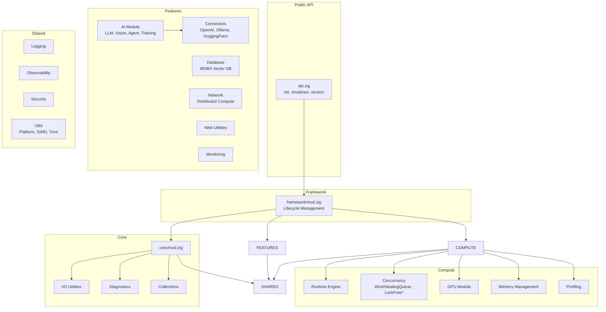
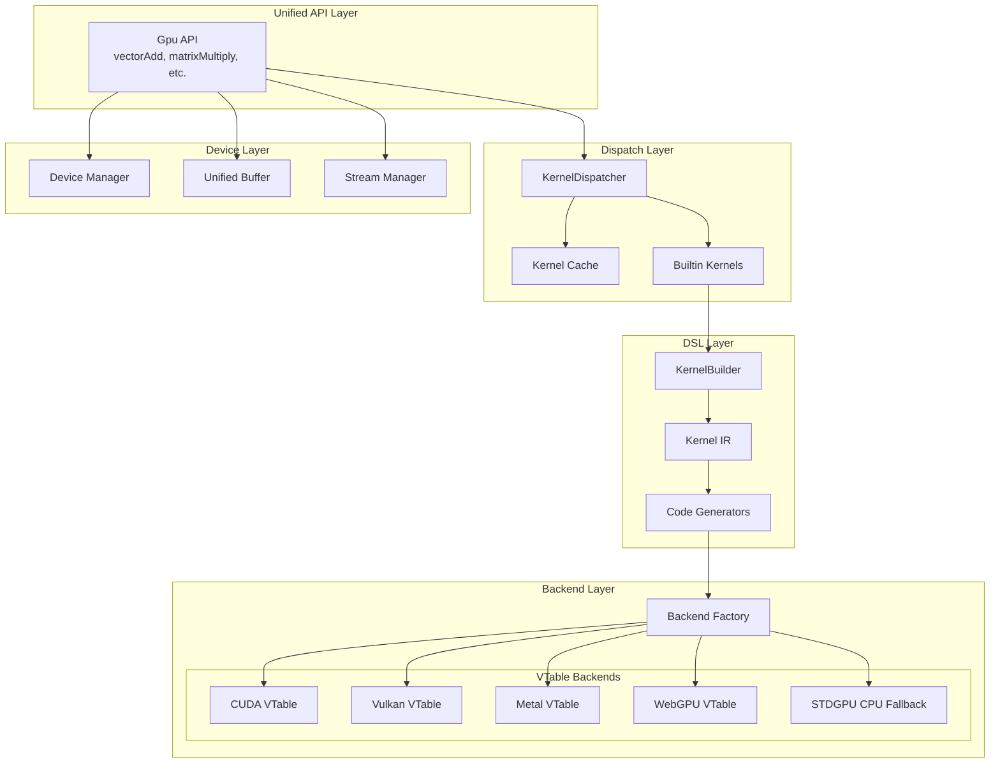

# ABI Framework
>
> **Codebase Status:** Synced with repository as of 2026-01-24.

<p align="center">
  
  
  
</p>

<p align="center">
  
  
  
  
</p>

<p align="center">
  
  
  
</p>

<p align="center">
  <strong>Modern Zig 0.16 framework for modular AI services, vector search, and high-performance systems tooling.</strong>
</p>

<p align="center">
  <a href="#-quick-start">Quick Start</a> •
  <a href="#-highlights">Highlights</a> •
  <a href="https://donaldfilimon.github.io/abi/">Documentation</a> •
  <a href="#-examples">Examples</a> •
  <a href="CONTRIBUTING.md">Contributing</a>
</p>

---

## Highlights

| Feature | Description | Status |
|---------|-------------|--------|
| **AI Runtime** | LLM inference (Llama-CPP parity), agent runtime, training pipelines |  |
| **Vector Database** | WDBX with HNSW/IVF-PQ indexing, hybrid search, diagnostics |  |
| **Compute Engine** | Work-stealing scheduler, NUMA-aware, lock-free primitives |  |
| **GPU Backends** | CUDA, Vulkan, Metal, WebGPU, FPGA with unified API, graceful degradation |  |
| **FPGA Acceleration** | LLM MatMul, Attention, KV-Cache kernels for AMD Alveo/Intel Agilex |  |
| **GPU Sync & Cache** | Event‑based synchronization (SyncEvent) and fast‑path kernel descriptor cache (KernelRing) |  |
| **Mega GPU Orchestration** | Cross-backend GPU coordination (CUDA+Vulkan+Metal), learning-based scheduler with Q-learning |  |
| **Self-Learning Agent** | GPU-aware AI agent with reinforcement learning for optimal resource scheduling |  |
| **Distributed Network** | Node discovery, Raft consensus, load balancing |  |
| **Observability** | Metrics, tracing, profiling, circuit breakers |  |
| **Interactive CLI** | TUI launcher, GPU dashboard, training commands, database operations |  |

<details>
<summary><strong>Detailed Feature Links</strong></summary>

- [Framework Guide](docs/framework.md) - Lifecycle and initialization
- [Compute Guide](docs/compute.md) - Work-stealing scheduler
- [AI Guide](docs/ai.md) - LLM, agents, training, embeddings
- [Database Guide](docs/database.md) - WDBX vector database
- [GPU Guide](docs/gpu.md) - Multi-backend GPU acceleration
- [Network Guide](docs/network.md) - Distributed compute
- [Monitoring Guide](docs/monitoring.md) - Observability and metrics

</details>

## Quick Start

> **Codebase Status:** Synced with repository as of 2026-01-24.

### Prerequisites

| Requirement | Version | Status |
|------------|---------|--------|
| Zig | 0.16.x |  |
| Git | Any |  |
| GPU Drivers | Latest |  |

### Build and Run the CLI

```bash
zig build
zig build run -- --help
zig build run -- --version
```

### Run Tests and Benchmarks

```bash
zig build test                    # Run all tests
zig build test --summary all      # Run tests with detailed output
zig test src/runtime/engine/engine.zig     # Test single file (new path)
zig test src/tests/mod.zig --test-filter "pattern"  # Filter tests
zig build test -Denable-gpu=true -Denable-network=true  # Test with features
zig build benchmarks              # Run performance benchmarks
```

### CLI Commands

#### General

```bash
zig build run -- --help           # Show all commands
zig build run -- --version        # Show version info
zig build run -- system-info       # System and framework status
```

#### Database

```bash
zig build run -- db stats
zig build run -- db add --id 1 --embed "text to embed"
zig build run -- db backup --path backup.db
zig build run -- db restore --path backup.db
```

#### AI & Agents

```bash
zig build run -- agent                          # Interactive agent
zig build run -- agent --message "Hello"          # Single message
zig build run -- agent --persona coder           # Use specific persona
```

#### GPU

```bash
zig build run -- gpu backends                  # List backends
zig build run -- gpu devices                   # List devices
zig build run -- gpu summary                   # GPU summary
```

#### Training

```bash
zig build run -- train run --epochs 10          # Run training
zig build run -- train info                     # Show config
zig build run -- train resume ./model.ckpt       # Resume from checkpoint
```

#### Explore codebase

```bash
zig build run -- explore "fn init" --level quick
zig build run -- explore "pub fn" --level thorough
```

---

For more detailed guides, see [docs/intro.md](docs/intro.md).

## What's New (2026.01)

<details open>
<summary><strong>Latest Updates</strong></summary>

| Category | Feature | Description |
|----------|---------|-------------|
| **GPU** | Multi-GPU Device Enumeration | Enumerate all GPUs across backends with `device.enumerateAllDevices()` |
| **GPU** | Backend Auto-Detection | Feature-based selection with configurable fallback chains |
| **GPU** | Unified Execution Coordinator | Automatic GPU→SIMD→scalar fallback via `ExecutionCoordinator` |
| **GPU** | std.gpu Integration | Zig 0.16 std.gpu compatibility layer with CPU fallback |
| **GPU** | Diagnostics & Error Context | Structured debugging with backend, operation, and timing info |
| **GPU** | Graceful Degradation | Automatic CPU fallback via `FailoverManager` |
| **GPU** | SIMD CPU Fallback | AVX/SSE/NEON accelerated operations in `stdgpu` backend |
| **Core** | Plugin Registry | Three-mode feature registration (comptime, runtime-toggle, dynamic) |
| **Core** | Runtime Consolidation | Unified `src/runtime/` with engine, scheduling, concurrency, memory |
| **Core** | O(1) Kernel Cache | Doubly-linked list LRU for constant-time cache operations |
| **CLI** | Runtime Flags | `--list-features`, `--enable-*`, `--disable-*` for feature control |
| **Database** | Diagnostics | Memory stats, health checks, configuration debugging |
| **AI** | Error Context | Structured error context for agent operations with retry tracking |
| **GPU** | Event‑Based Sync (`SyncEvent`) | Non‑blocking host/device sync using `std.atomic` and `std.Thread.Futex` |
| **GPU** | Fast‑Path Kernel Cache (`KernelRing`) | Reuses recent kernel launch configs; statistics visible via dispatcher stats |
| **Codebase** | Deprecated I/O migration | Replaced all `std.fs.cwd()` usages with `std.io.cwd()` for Zig 0.16 compliance |

</details>

## Documentation

- **[Online Docs](https://donaldfilimon.github.io/abi/)** - Searchable static site
- **[GPU Backend Guide](docs/gpu-backends.md)** - Overview of supported GPU backends and enable flags
## Performance Results (Benchmark Suite)
The `zig build benchmarks` target runs a comprehensive suite covering core framework, SIMD, database, GPU, and networking.

| Benchmark | Ops/sec |
|-----------|---------|
| Framework Initialization | 175 |
| Logging Operations | 331,960 |
| Configuration Loading | 66,476,102 |
| Memory Allocation (1KB) | 464,712 |
| SIMD Vector Dot Product | 84,875,233 |
| SIMD Vector Addition | 84,709,869 |
| Compute Engine Task | 93,368 |
| Database Vector Insert | 68,444 |
| Database Vector Search | 56,563 |
| JSON Parse/Serialize | 83,371 |
| GPU Availability Check | 183 |
| Network Registry Operations | 84,831 |

These numbers are from a ReleaseFast build on a typical development workstation; actual performance varies with hardware and enabled backends.
- [Introduction](docs/intro.md) - Architecture overview
- [API Reference](API_REFERENCE.md) - Public API summary
- [Quickstart](QUICKSTART.md) - Getting started guide
- [Migration Guide](docs/migration/zig-0.16-migration.md) - Zig 0.16 patterns
- [Troubleshooting](docs/troubleshooting.md) - Common issues

## Requirements

- Zig 0.16.x (minimum 0.16.0)

## Build

```bash
zig build                    # Build the project
zig build test --summary all # Run tests with output
zig build -Doptimize=ReleaseFast

# Feature-gated builds
zig build -Denable-ai=true -Denable-gpu=false -Denable-database=true
```

## Feature Flags

| Flag | Default | Description |
|------|---------|-------------|
| `-Denable-ai` | true | AI features and connectors |
| `-Denable-llm` | true | Local LLM inference |
| `-Denable-gpu` | true | GPU acceleration |
| `-Denable-web` | true | Web utilities and HTTP |
| `-Denable-database` | true | Vector database (WDBX) |
| `-Denable-network` | true | Distributed compute |
| `-Denable-profiling` | true | Profiling and metrics |

**GPU Backends (unified syntax):** `-Dgpu-backend=vulkan` (default), `-Dgpu-backend=cuda`, `-Dgpu-backend=metal`, `-Dgpu-backend=webgpu`, `-Dgpu-backend=cuda,vulkan` (multiple)

> Legacy flags (`-Dgpu-vulkan`, `-Dgpu-cuda`, etc.) are deprecated but still work with a warning.

## Quick Start

### Installation

```bash
# Clone the repository
git clone https://github.com/donaldfilimon/abi.git
cd abi

# Build the project
zig build

# Run tests
zig build test --summary all

# Try the CLI
zig build run -- --help
```

### Basic Framework Usage

```src/main.zig#L140-167
const std = @import("std");
const abi = @import("abi");

pub fn main() !void {
    var gpa = std.heap.GeneralPurposeAllocator(.{}){};
    defer _ = gpa.deinit();
    const allocator = gpa.allocator();

    // Using the unified Config with builder pattern
    const config = abi.Config.init()
        .withAI(true)
        .withGPU(true)
        .withDatabase(true);

    var framework = try abi.Framework.init(allocator, config);
    defer framework.deinit();

    std.debug.print("ABI version: {s}\n", .{abi.version()});

    // Access feature modules through the framework
    if (framework.ai()) |ai| {
        // Use AI features
        _ = ai;
    }
}
```

<details>

<summary><strong>Backward-compatible initialization</strong></summary>

```src/framework.zig#L174-175
var framework = try abi.init(allocator, .{});
defer abi.shutdown(&framework);
```

</details>

## Examples

### AI Agent Chat

```src/examples/ai_agent.zig#L10-30

const std = @import("std");

const abi = @import("abi");


pub fn main() !void {

    var gpa = std.heap.GeneralPurposeAllocator(.{}){};

    defer _ = gpa.deinit();

    const allocator = gpa.allocator();


    // Create an AI agent

    var agent = try abi.ai.Agent.init(allocator, .{

        .name = "assistant",

        .temperature = 0.7,

        .enable_history = true,

    });

    defer agent.deinit();


    // Chat with the agent
    const response = try agent.chat("Explain Zig's comptime in one sentence.", allocator);
    defer allocator.free(response);
    std.debug.print("Agent: {s}\n", .{response});
}
```

### Vector Database Operations

```src/examples/vector_db.zig#L10-35

const std = @import("std");

const abi = @import("abi");


pub fn main() !void {

    var gpa = std.heap.GeneralPurposeAllocator(.{}){};

    defer _ = gpa.deinit();

    const allocator = gpa.allocator();


    // Create a vector database

    var db = try abi.wdbx.createDatabase(allocator, .{ .dimension = 384 });

    defer db.deinit();


    // Insert vectors

    try db.insertVector(1, &[_]f32{ 0.1, 0.2, 0.3 } ++ [_]f32{0} ** 381);

    try db.insertVector(2, &[_]f32{ 0.4, 0.5, 0.6 } ++ [_]f32{0} ** 381);


    // Search for similar vectors

    const results = try db.searchVectors(&[_]f32{ 0.1, 0.2, 0.3 } ++ [_]f32{0} ** 381, 10);

    defer allocator.free(results);


    for (results) |result| {

        std.debug.print("ID: {d}, Score: {d:.4}\n", .{ result.id, result.score });

    }

}

```

### GPU-Accelerated Compute

```zig
const std = @import("std");
const abi = @import("abi");

pub fn main() !void {
    var gpa = std.heap.GeneralPurposeAllocator(.{}){};
    defer _ = gpa.deinit();
    const allocator = gpa.allocator();

    // Initialize GPU with automatic backend selection
    var gpu = try abi.Gpu.init(allocator, .{
        .enable_profiling = true,
        .memory_mode = .automatic,
    });
    defer gpu.deinit();

    // Create buffers
    const a = try gpu.createBufferFromSlice(f32, &[_]f32{ 1, 2, 3, 4, 5, 6, 7, 8 }, .{});
    defer gpu.destroyBuffer(a);
    const b = try gpu.createBufferFromSlice(f32, &[_]f32{ 8, 7, 6, 5, 4, 3, 2, 1 }, .{});
    defer gpu.destroyBuffer(b);
    const result = try gpu.createBuffer(8 * @sizeOf(f32), .{});
    defer gpu.destroyBuffer(result);

    // Execute vector addition (GPU→SIMD→scalar fallback)
    _ = try gpu.vectorAdd(a, b, result);

    // Read results
    var output: [8]f32 = undefined;
    try result.read(f32, &output);
    std.debug.print("Result: {any}\n", .{output}); // { 9, 9, 9, 9, 9, 9, 9, 9 }
}
```

### Training Pipeline

```zig
const abi = @import("abi");
const std = @import("std");

pub fn main() !void {
    var gpa = std.heap.GeneralPurposeAllocator(.{}){};
    defer _ = gpa.deinit();
    const allocator = gpa.allocator();

    const config = abi.ai.TrainingConfig{
        .epochs = 10,
        .batch_size = 32,
        .sample_count = 1024,
        .model_size = 512,
        .learning_rate = 0.001,
        .optimizer = .adamw,
    };

    var result = try abi.ai.trainWithResult(allocator, config);
    defer result.deinit();

    std.debug.print("Final loss: {d:.6}\n", .{result.report.final_loss});
}
```

**CLI Training:**

```bash
zig build run -- train run --epochs 10 --batch-size 32
zig build run -- train resume ./checkpoint.ckpt
zig build run -- llm chat model.gguf
```

## CLI Commands

```bash
zig build run -- --help            # Show help
zig build run -- tui               # Interactive launcher
zig build run -- db stats          # Database statistics
zig build run -- gpu backends      # List GPU backends
zig build run -- agent             # AI agent mode
zig build run -- convert dataset --help # Dataset conversion

# Runtime feature flags (new)
zig build run -- --list-features              # List available features and status
zig build run -- --enable-gpu db stats        # Enable feature for this run
zig build run -- --disable-ai llm info        # Disable feature for this run
```

### Lint & Typecheck

- `zig build lint` runs `zig fmt --check .`
- `zig build typecheck` compiles the test suite without running it

## Architecture

```
abi/
├── src/
│   ├── abi.zig          # Public API entry point
│   ├── config.zig       # Unified configuration system
│   ├── framework.zig    # Framework orchestration
│   ├── registry/        # Plugin registry system (comptime, runtime, dynamic)
│   ├── runtime/         # Always-on infrastructure
│   │   ├── engine/      # Work-stealing task execution
│   │   ├── scheduling/  # Futures, cancellation, task groups
│   │   ├── concurrency/ # Lock-free primitives
│   │   └── memory/      # Memory pools and allocators
│   ├── gpu/             # GPU backends and unified API
│   ├── ai/              # AI module with sub-features
│   │   ├── llm/         # Local LLM inference
│   │   ├── embeddings/  # Vector embeddings
│   │   ├── agents/      # AI agent runtime
│   │   └── training/    # Training pipelines
│   ├── database/        # Vector database (WDBX)
│   ├── network/         # Distributed compute and Raft
│   ├── observability/   # Metrics, tracing, profiling
│   ├── web/             # Web/HTTP utilities
│   └── shared/          # Shared utilities and platform helpers
├── tools/cli/           # CLI implementation
├── benchmarks/          # Performance benchmarks
└── docs/                # Documentation
```

## Visual Overview

### System Architecture



### GPU Architecture



## Testing

```bash
zig build test --summary all                    # All tests
zig test src/runtime/engine/engine.zig          # Single file
zig test src/tests/mod.zig --test-filter "pat"  # Filter tests
zig build benchmarks                            # Run benchmarks
```

## Environment Variables

| Variable | Default | Description |
|----------|---------|-------------|
| `ABI_OPENAI_API_KEY` | - | OpenAI API key |
| `ABI_OLLAMA_HOST` | `http://127.0.0.1:11434` | Ollama host |
| `ABI_OLLAMA_MODEL` | `gpt-oss` | Default Ollama model |
| `ABI_HF_API_TOKEN` | - | HuggingFace token |
| `DISCORD_BOT_TOKEN` | - | Discord bot token |

## Contributing

See [CONTRIBUTING.md](CONTRIBUTING.md) for development workflow and [CLAUDE.md](CLAUDE.md) for coding guidelines.

## Project Status

| Milestone | Status | Progress |
|-----------|--------|----------|
| Zig 0.16 Migration |  | 100% |
| Llama-CPP Parity |  | 100% |
| Feature Stubs |  | 100% |
| Refactoring (Phases 1-6) |  | 100% |
| Plugin Registry |  | 100% |
| Runtime Consolidation |  | 100% |

<details>
<summary><strong>Refactoring Details</strong></summary>

- Plugin registry system (`src/registry/`)
- Runtime consolidation (`src/runtime/`)
- CLI runtime flags (`--list-features`, `--enable-*`, `--disable-*`)

See [ROADMAP.md](ROADMAP.md) for upcoming milestones and [docs/plans/archive/2026-01-17-src-refactoring.md](docs/plans/archive/2026-01-17-src-refactoring.md) for refactoring details.

</details>

## Support & Community

<p align="center">
  <a href="https://github.com/donaldfilimon/abi/issues"></a>
  <a href="https://github.com/donaldfilimon/abi/discussions"></a>
  <a href="CONTRIBUTING.md"></a>
</p>

## License

<p align="center">
  
</p>

See [LICENSE](LICENSE) for details.

---

<p align="center">
  Made with Zig
</p>
