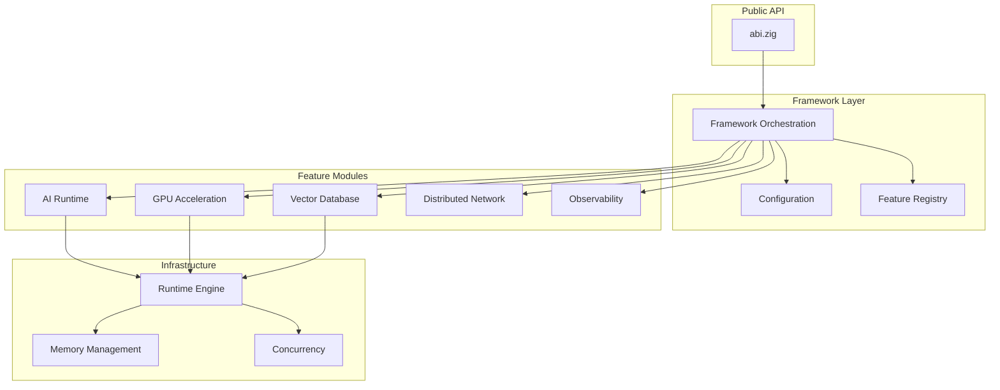

<div align="center">

# ABI Framework


<br/>


<br/><br/>

**A modern Zig 0.16.0-dev.2637+6a9510c0e framework for AI services, vector search, and high-performance systems**

[Quick Start](#-quick-start) · [Documentation](https://donaldfilimon.github.io/abi/) · [Examples](#-examples) · [Contributing](CONTRIBUTING.md)

**Contents:** [Why ABI?](#why-abi) · [Highlights](#highlights) · [Quick Start](#-quick-start) · [Examples](#-examples) · [CLI Reference](#cli-reference) · [Architecture](#architecture) · [Feature Flags](#feature-flags) · [Documentation](#documentation)

<br/>

```
    ╔═══════════════════════════════════════════════════════════════╗
    ║   LLM Inference  ·  Vector Database  ·  GPU Acceleration      ║
    ║   Agent Runtime  ·  Distributed Compute  ·  Training Pipelines║
    ╚═══════════════════════════════════════════════════════════════╝
```

</div>

## Why ABI?

<table>
<tr>
<td width="33%" valign="top">

### Lightning Fast
Built with Zig for zero-cost abstractions, comptime optimization, and bare-metal performance. SIMD-accelerated operations throughout.

</td>
<td width="33%" valign="top">

### Production Ready
Battle-tested with 1296 tests (1290 passing, 6 skip), comprehensive error handling, graceful degradation, and circuit breakers for resilience.

</td>
<td width="33%" valign="top">

### Fully Modular
Enable only what you need. Every feature is toggleable at compile-time with zero overhead for disabled modules.

</td>
</tr>
</table>

---

## Highlights

| Feature | Description | Status |
|:--------|:------------|:------:|
| **AI Runtime** | LLM inference with Llama-CPP parity, agent runtime, training pipelines |  |
| **Vector Database** | WDBX with HNSW/IVF-PQ indexing, hybrid search, real-time analytics |  |
| **GPU Acceleration** | CUDA, Vulkan, Metal, WebGPU, TPU (stub), FPGA; multi-threaded CPU fallback |  |
| **Compute Engine** | Work-stealing scheduler, NUMA-aware, lock-free primitives |  |
| **Distributed Network** | Raft consensus, node discovery, load balancing |  |
| **Observability** | Metrics, tracing, profiling, circuit breakers |  |
| **Interactive CLI** | UI launcher + dashboards (db/gpu/model/network/bench/brain/streaming) |  |
| **Streaming API** | SSE/WebSocket inference, circuit breakers, session recovery |  |

---

## Quick Start

### Installation

```bash
git clone https://github.com/donaldfilimon/abi.git
cd abi
zig build
zig build run -- --help
```

Ensure your `zig` matches the version in `.zigversion`.

```bash
# Keep zvm current
zvm upgrade

# Developer convenience (latest dev toolchain)
zvm use master

# Reproducible/local CI parity (pinned in repo)
PINNED_ZIG="$(cat .zigversion)"
zvm install "$PINNED_ZIG"
zvm use "$PINNED_ZIG"

# Verify active zig matches the repository pin
zig version
cat .zigversion

# Diagnose PATH/version drift (recommended before running quality gates)
zig build toolchain-doctor
zig run tools/scripts/toolchain_doctor.zig

# If `which zig` is not ~/.zvm/bin/zig, fix PATH precedence first:
export PATH="$HOME/.zvm/bin:$PATH"
```

### Requirements

| Dependency | Version | Required |
|:-----------|:--------|:--------:|
| Zig | `0.16.0-dev.2637+6a9510c0e` or newer | Yes |
| Git | Any | Yes |
| GPU Drivers | Latest | Optional |

### Hello World

```zig
const std = @import("std");
const abi = @import("abi");

pub fn main() !void {
    var gpa = std.heap.GeneralPurposeAllocator(.{}){};
    defer _ = gpa.deinit();
    const allocator = gpa.allocator();

    // Initialize with builder pattern
    var framework = try abi.Framework.builder(allocator)
        .withAiDefaults()
        .withGpuDefaults()
        .withDatabaseDefaults()
        .build();
    defer framework.deinit();

    std.debug.print("ABI v{s} ready!\n", .{abi.version()});
}
```

---

## Examples

<details open>
<summary><b>AI Agent Chat</b></summary>

```zig
const abi = @import("abi");

pub fn main() !void {
    var gpa = std.heap.GeneralPurposeAllocator(.{}){};
    const allocator = gpa.allocator();
    defer _ = gpa.deinit();

    var agent = try abi.ai.Agent.init(allocator, .{
        .name = "assistant",
        .temperature = 0.7,
        .enable_history = true,
    });
    defer agent.deinit();

    const response = try agent.chat("Explain Zig's comptime in one sentence.", allocator);
    defer allocator.free(response);

    std.debug.print("Agent: {s}\n", .{response});
}
```

</details>

<details>
<summary><b>Vector Database</b></summary>

```zig
const abi = @import("abi");

pub fn main() !void {
    var gpa = std.heap.GeneralPurposeAllocator(.{}){};
    const allocator = gpa.allocator();
    defer _ = gpa.deinit();

    // Create a 384-dimensional vector database
    var db = try abi.database.open(allocator, "vectors");
    defer db.deinit();

    // Insert vectors
    try db.insertVector(1, &embedding1);
    try db.insertVector(2, &embedding2);

    // Search for similar vectors
    const results = try db.searchVectors(&query_embedding, 10);
    defer allocator.free(results);

    for (results) |result| {
        std.debug.print("ID: {d}, Score: {d:.4}\n", .{ result.id, result.score });
    }
}
```

</details>

<details>
<summary><b>GPU-Accelerated Compute</b></summary>

```zig
const abi = @import("abi");

pub fn main() !void {
    var gpa = std.heap.GeneralPurposeAllocator(.{}){};
    const allocator = gpa.allocator();
    defer _ = gpa.deinit();

    // Auto-selects best available backend (CUDA > Vulkan > Metal > CPU)
    var gpu = try abi.Gpu.init(allocator, .{
        .enable_profiling = true,
        .memory_mode = .automatic,
    });
    defer gpu.deinit();

    const a = try gpu.createBufferFromSlice(f32, &[_]f32{ 1, 2, 3, 4 }, .{});
    const b = try gpu.createBufferFromSlice(f32, &[_]f32{ 4, 3, 2, 1 }, .{});
    const result = try gpu.createBuffer(4 * @sizeOf(f32), .{});
    defer { gpu.destroyBuffer(a); gpu.destroyBuffer(b); gpu.destroyBuffer(result); }

    // Executes on GPU with automatic SIMD/scalar fallback
    _ = try gpu.vectorAdd(a, b, result);

    var output: [4]f32 = undefined;
    try result.read(f32, &output);
    // output = { 5, 5, 5, 5 }
}
```

</details>

<details>
<summary><b>Training Pipeline</b></summary>

```zig
const abi = @import("abi");

pub fn main() !void {
    var gpa = std.heap.GeneralPurposeAllocator(.{}){};
    const allocator = gpa.allocator();
    defer _ = gpa.deinit();

    const config = abi.ai.TrainingConfig{
        .epochs = 10,
        .batch_size = 32,
        .learning_rate = 0.001,
        .optimizer = .adamw,
    };

    var result = try abi.ai.trainWithResult(allocator, config);
    defer result.deinit();

    std.debug.print("Final loss: {d:.6}\n", .{result.report.final_loss});
}
```

</details>

---

## CLI Reference

```bash
# Core Commands
abi --help                    # Show all commands
abi system-info               # System and feature status
abi ui launch                 # Interactive TUI launcher

# Database Operations
abi db stats                  # Database statistics
abi db add --id 1 --embed "text"
abi db search --embed "query" --top 5
abi db backup --path backup.db

# AI & Agents
abi agent                     # Interactive chat
abi agent --persona coder     # Use specific persona
abi agent -m "Hello"          # One-shot message
abi llm chat model.gguf       # Chat with local model

# GPU Management
abi gpu backends              # List available backends
abi gpu devices               # Enumerate all GPUs
abi gpu summary               # Quick status

# Training
abi train run --epochs 10     # Start training
abi train auto               # Auto-train Abbey/Aviva/Abi with default data
abi train auto --multimodal  # Include vision/multimodal micro-steps
abi train resume ./checkpoint # Resume from checkpoint
abi train monitor             # Real-time metrics

# Plugins & Info
abi plugins list              # List available plugins
abi --list-features           # Show feature status

# MCP/ACP Servers
abi mcp serve                 # Start MCP server (stdio JSON-RPC)
abi mcp tools                 # List available MCP tools
abi acp card                  # Print agent card JSON
abi serve -m model.gguf       # Alias for llm serve

# Runtime Feature Flags
abi --list-features           # Show feature status
abi --enable-gpu db stats     # Enable feature for command
abi --disable-ai system-info  # Disable feature for command
```

---

## Performance

<div align="center">

| Benchmark | Operations/sec |
|:----------|---------------:|
| SIMD Vector Dot Product | **84,875,233** |
| SIMD Vector Addition | **84,709,869** |
| Configuration Loading | **66,476,102** |
| Memory Allocation (1KB) | **464,712** |
| Logging Operations | **331,960** |
| Compute Engine Task | **93,368** |
| Network Registry Ops | **84,831** |
| JSON Parse/Serialize | **83,371** |
| Database Vector Insert | **68,444** |
| Database Vector Search | **56,563** |

<sub>ReleaseFast build on typical development workstation. Run `zig build benchmarks` to test your system.</sub>

</div>

---

## Architecture

```
abi/
├── src/
│   ├── abi.zig           # Public API module root
│   ├── api/              # Entry points
│   │   └── main.zig      # CLI fallback entrypoint
│   │
│   ├── core/             # Framework orchestration and config
│   │   ├── config/       # Unified configuration
│   │   ├── framework.zig # Lifecycle orchestration
│   │   └── registry/     # Feature registry
│   │
│   ├── features/         # Feature modules (16 dirs, 24 catalog entries, 7 AI sub-features)
│   │   ├── ai/           # AI Module (llm, agents, training, embeddings, personas, reasoning, constitution)
│   │   ├── analytics/    # Event Tracking & Experiments
│   │   ├── auth/         # Security infrastructure (17 modules)
│   │   ├── benchmarks/   # Performance benchmarks
│   │   ├── cache/        # In-memory LRU/LFU, TTL, eviction
│   │   ├── cloud/        # Cloud Function Adapters (AWS, GCP, Azure)
│   │   ├── database/     # Vector Database (WDBX)
│   │   ├── gateway/      # API gateway: routing, rate limiting, circuit breaker
│   │   ├── gpu/          # GPU Acceleration (10 backends)
│   │   ├── messaging/    # Event bus, pub/sub, message queues
│   │   ├── mobile/       # Mobile platform support
│   │   ├── network/      # Distributed Compute
│   │   ├── observability/ # Metrics, Tracing & Pages
│   │   ├── search/       # Full-text BM25 search
│   │   ├── storage/      # Unified file/object storage
│   │   └── web/          # Web/HTTP utilities
│   │
│   └── services/         # Shared infrastructure
│       ├── runtime/      # Compute infrastructure (engine, concurrency, memory)
│       ├── platform/     # Platform detection (OS, arch, CPU)
│       ├── shared/       # Utilities (security, io, utils)
│       ├── connectors/   # LLM provider connectors (15 providers + scheduler + discord)
│       ├── mcp/          # MCP server (JSON-RPC 2.0 over stdio)
│       ├── acp/          # Agent Communication Protocol
│       ├── ha/           # High availability (backup, PITR, replication)
│       ├── tasks/        # Task management
│       └── tests/        # Test infrastructure
│
├── tools/cli/            # CLI implementation
├── examples/             # Usage examples
└── docs/api/             # Auto-generated API docs (abi gendocs or zig build gendocs)
```

<details>
<summary><b>System Architecture Diagram</b></summary>



</details>

---

## Feature Flags

All features are enabled by default. Disable unused features to reduce binary size.

| Flag | Default | Description |
|:-----|:-------:|:------------|
| `-Denable-ai` | true | AI features, agents, and connectors |
| `-Denable-llm` | true | Local LLM inference |
| `-Denable-gpu` | true | GPU acceleration |
| `-Denable-database` | true | Vector database (WDBX) |
| `-Denable-network` | true | Distributed compute |
| `-Denable-web` | true | HTTP client utilities |
| `-Denable-profiling` | true | Performance profiling |
| `-Denable-cache` | true | In-memory LRU/LFU cache |
| `-Denable-gateway` | true | API gateway, rate limiting, circuit breaker |
| `-Denable-messaging` | true | Pub/sub, message queues |
| `-Denable-search` | true | Full-text BM25 search |
| `-Denable-storage` | true | Unified object storage |
| `-Denable-cloud` | true | Cloud function adapters |
| `-Denable-auth` | true | Security infrastructure |
| `-Denable-mobile` | false | Mobile platform support |

### GPU Backend Selection

```bash
# Single backend
zig build -Dgpu-backend=vulkan
zig build -Dgpu-backend=cuda
zig build -Dgpu-backend=metal
zig build -Dgpu-backend=webgpu
zig build -Dgpu-backend=tpu    # Stub until TPU runtime linked

# Multiple backends (comma-separated)
zig build -Dgpu-backend=cuda,vulkan

# Auto-detect best available
zig build -Dgpu-backend=auto
```

---

## Documentation

| Resource | Description |
|:---------|:------------|
| [API Reference](docs/api/index.md) | Auto-generated API docs (`abi gendocs` or `zig build gendocs`) |
| [Developer Guide](CLAUDE.md) | Zig 0.16 patterns, gotchas, features, CLI; **main entry for AI assistants** |
| [Agent Guidelines](AGENTS.md) | Structure, style, testing, **plans index and multi-agent roles (A0–A4)** |
| [.claude/](.claude/README.md) | Rules (Zig gotchas), skills (`/baseline-sync`, `/zig-migrate`), hooks |
| [.cursor/](.cursor/README.md) | Cursor agents (e.g. Metal/CoreML), plans |
| [plans/plan.md](plans/plan.md) | Master execution plan; [CLAUDE.md#skills-plans-and-agents](CLAUDE.md#skills-plans-and-agents-full-index) for full index |

**For AI assistants (Claude, Codex, Cursor):** Setup is **ready for use**. Start at [CLAUDE.md](CLAUDE.md); use [Skills, Plans, and Agents](CLAUDE.md#skills-plans-and-agents-full-index) for rules, skills, plans, and agents. Root config: `.claude/`, `.cursor/`. Reuse in other projects: copy those dirs and add a CLAUDE.md (or equivalent) pointing to your baselines and plans.

```bash
# Run all tests
zig build test --summary all

# Test specific module
zig test src/services/runtime/engine/engine.zig

# Filter tests by pattern
zig test src/services/tests/mod.zig --test-filter "pattern"

# Run benchmarks
zig build benchmarks

# Lint check
zig build lint

# Format sources in place
zig build fix
```

---

## Environment Variables

| Variable | Description |
|:---------|:------------|
| `ABI_GPU_BACKEND` | GPU backend: `auto`, `cuda`, `vulkan`, `metal`, `webgpu`, `tpu`, `none` |
| `ABI_OPENAI_API_KEY` | OpenAI API key |
| `ABI_ANTHROPIC_API_KEY` | Anthropic/Claude API key |
| `ABI_OLLAMA_HOST` | Ollama host (default: `http://127.0.0.1:11434`) |
| `ABI_OLLAMA_MODEL` | Default Ollama model |
| `ABI_HF_API_TOKEN` | HuggingFace API token |
| `ABI_LM_STUDIO_HOST` | LM Studio host (default: `http://localhost:1234`) |
| `ABI_LM_STUDIO_MODEL` | Default LM Studio model |
| `ABI_VLLM_HOST` | vLLM host (default: `http://localhost:8000`) |
| `ABI_VLLM_MODEL` | Default vLLM model |
| `DISCORD_BOT_TOKEN` | Discord bot token |

---

## Project Status

| Milestone | Status |
|:----------|:------:|
| Zig 0.16.0-dev.2637+6a9510c0e Migration |  |
| Llama-CPP Parity |  |
| C Library Bindings |  |
| Plugin Registry |  |
| Runtime Consolidation |  |
| Feature Stubs |  |
| Multi-GPU Orchestration |  |
| Modular Refactor |  |
| v2 Architecture Rewrite |  |
| Phase 9 Feature Modules |  |
| MCP/ACP Server Infrastructure |  |
| Local Server Connectors |  |

See [CONTRIBUTING.md](CONTRIBUTING.md) for development workflow.

---

## Contributing

We welcome contributions! Please see:

- [CONTRIBUTING.md](CONTRIBUTING.md) — Development workflow and PR checklist
- [AGENTS.md](AGENTS.md) — Baseline agent guidelines
- [CLAUDE.md](CLAUDE.md) — Detailed coding guidelines and patterns
- [SECURITY.md](SECURITY.md) — Security policy and reporting

<div align="center">

[](https://github.com/donaldfilimon/abi/issues)
[](https://github.com/donaldfilimon/abi/discussions)
[](CONTRIBUTING.md)

</div>

---

<div align="center">

[](LICENSE)

MIT License - See [LICENSE](LICENSE) for details.

<br/>

**Built with Zig**

</div>

## Zig Skill
Use [$zig](/Users/donaldfilimon/.codex/skills/zig/SKILL.md) for ABI Zig 0.16-dev syntax updates, modular build/layout guidance, and validation workflows.
