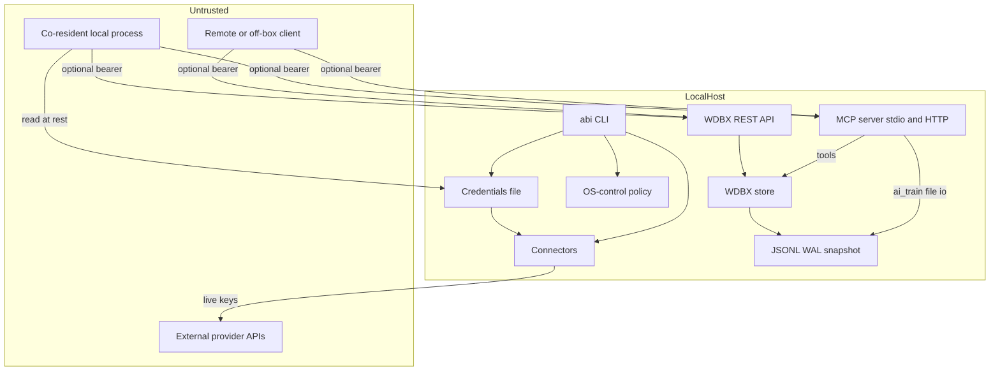

# ABI — Threat Model

> Repository: `/Users/donaldfilimon/abi` (branch `main`). Scope: runtime behavior of the ABI Zig framework — CLI, MCP server, WDBX store + REST API, connectors, credentials/auth, OS-control, plugins. Build/CI and tests are called out separately and are largely out of scope for runtime risk.
>
> Authored as an AppSec-grade, evidence-anchored model. Every architectural claim cites a repo path + symbol. **Revised** to the operator-confirmed context below: deployment is **local single-user (listeners NOT exposed beyond loopback)**, but assets are **real production credentials** (`~/.abi/credentials.json` or equivalent XDG/overridden path holds live API keys with billing/quota). This revision down-ranks remote-exposure threats and up-ranks credential-confidentiality + browser-reachability (CSRF / DNS-rebinding of loopback) threats accordingly.

## Executive summary

The dominant risk theme is **control/data planes reachable beyond their intended loopback boundary**. ABI ships two HTTP listeners — the MCP server (`src/mcp/server.zig`) and the WDBX REST API (`src/features/wdbx/rest.zig`) — both hardcoded to `127.0.0.1`; both can require bearer tokens (`ABI_MCP_HTTP_TOKEN`, `ABI_WDBX_REST_TOKEN`), but neither provides TLS, per-route authorization, origin checks, or rate limiting. The code design (loopback-only) is sound for a single-user box, but the operator confirms these are or will be **exposed beyond loopback** (reverse proxy / port-forward / container mapping), which converts "any local process" into "any reachable client" with access to MCP tools (including file-touching `ai_train` and `plugin_run`) and WDBX read/write/query if token auth is not enabled/fronted. WDBX cluster RPC is a separate TCP surface: it now refuses non-loopback binds unless `ABI_WDBX_CLUSTER_TOKEN` is configured, accepts authenticated `AUTH <token>` RequestVote/AppendEntries frames, and can restrict node ids via `ABI_WDBX_CLUSTER_PEERS`, but it still lacks TLS/mTLS, rate limiting, dynamic membership, and production deployment controls. The second theme is **secrets at rest and in logs**: provider API keys are still persisted as plaintext JSON (resolved from `ABI_CREDENTIALS_PATH`, `XDG_CONFIG_HOME/abi/`, or `~/.abi/` as fallback), but POSIX-capable targets now create/repair `~/.abi` as `0700` and `credentials.json` as `0600` before secret bytes are written; Windows ACL/keychain support and memory zeroing remain absent. Discord and Twilio connector logs now redact message/provider-response bodies to metadata, but other live connector/log flows should still be reviewed before treating logs as PII-safe. By contrast, the OS-control execute path — the surface most likely to be an RCE primitive — is **well-sandboxed** (allowlist of 5 read-only commands, denylist, workspace-path containment, no shell, mandatory `--confirm`) and is *not* a meaningful risk as built. Highest-risk areas for manual review: `src/mcp/server.zig`, `src/features/wdbx/rest.zig`, and `src/foundation/credentials.zig`.

## Scope and assumptions

**In-scope paths:**
- `src/mcp/` — MCP JSON-RPC server (stdio + HTTP/SSE), tool handlers.
- `src/features/wdbx/` — vector/block store, JSONL/WAL/snapshot persistence, REST API.
- `src/connectors/` — OpenAI/Anthropic/Grok/Discord/Twilio/HTTP outbound clients.
- `src/foundation/credentials.zig`, `src/cli/handlers/auth.zig` — secret storage + auth CLI.
- `src/features/os_control/` — host command execution under policy.
- `src/features/tui/` — interactive `agent tui` REPL + diagnostics dashboard (stdin byte parser + ANSI render of state fields).
- `src/cli/`, `src/main.zig` — CLI entry, dispatch, argument parsing.
- `src/plugins/`, `src/plugin_registry.zig`, `tools/generate_plugin_registry.zig` — plugin manifest + registry.

**Out of scope (this pass):** build/CI tooling, benchmark harnesses, test fixtures (`src/**/tests.zig`, `tests/`), docs. WDBX cluster RPC (`wdbx cluster serve`) is **now a live surface** (`src/features/wdbx/cluster_rpc.zig` implements real `RequestVote`/`AppendEntries` over `std.Io.net`, dispatched by `clusterServe` in `src/cli/handlers/wdbx_runtime.zig`). Unlike the MCP/REST listeners it defaults to loopback **but supports an explicit routable bind** (`0.0.0.0` / a NIC). Non-loopback cluster serving now requires `ABI_WDBX_CLUSTER_TOKEN`, authenticated frames use `AUTH <token> ...`, and `ABI_WDBX_CLUSTER_PEERS` can restrict accepted node ids — see TM-013. TLS/mTLS, rate limiting, dynamic membership, and deployment controls remain future work.

**Operator-confirmed context (drives ranking):**
- **Deployment:** a listener is or will be reachable off-box (reverse proxy / port-forward / 0.0.0.0 / container port map). *The code binds `127.0.0.1`; exposure is an operator/topology decision, so listener findings are ranked on the assumption that this binding is fronted, not as a code-level remote bind.*
- **Local attacker in scope:** co-resident processes / other OS users are treated as attackers.
- **Data sensitivity:** mixed/unknown → ranked conservatively as if real provider keys and sensitive WDBX contents are present.

**Open questions that would materially change ranking:**
1. When "exposed beyond loopback," is anything (auth proxy, network ACL, mTLS) placed in front of the MCP/WDBX listeners, or are they exposed raw? (If raw → TM-001/TM-002 are critical.)
2. Are MCP tool inputs (e.g., `ai_train` `dataset`/`artifact_dir`) ever populated from a remote/untrusted caller, or only from a trusted local agent config? (Drives TM-003.)
3. Is any connector ever configured (`base_url`, `.live` transport) from a file/env an attacker could influence? (Drives TM-007.)

## System model

### Primary components
- **CLI (`abi`)** — `src/main.zig`, `src/cli/dispatch.zig`. Frozen top-level commands; routes to handlers. No shell expansion; direct string-match dispatch.
- **MCP server (`abi-mcp`)** — `src/mcp/server.zig`, `handlers.zig`. JSON-RPC 2.0 over **stdio** (default) and optional **HTTP/SSE** on `127.0.0.1:8080` (`ABI_MCP_HTTP_PORT`); HTTP/SSE can require `Authorization: Bearer <token>` via `ABI_MCP_HTTP_TOKEN`. Exposes 12 tools.
- **WDBX store** — `src/features/wdbx/`. In-memory KV + vector store (HNSW), persisted as JSONL segments, with WAL (CRC32-framed) and snapshots (SHA-256-checksummed).
- **WDBX REST API** — `src/features/wdbx/rest.zig`. HTTP on `127.0.0.1` (`wdbx api serve <port>`), endpoints `/insert /query /verify /health /stats`.
- **Connectors** — `src/connectors/`. Outbound clients with explicit `.local` (mock) vs `.live` (network) transport gating.
- **Credentials store** — `src/foundation/credentials.zig`. Plaintext JSON (resolved from `ABI_CREDENTIALS_PATH`, `XDG_CONFIG_HOME/abi/`, or `~/.abi/` as fallback); managed by `abi auth`.
- **OS-control** — `src/features/os_control/mod.zig`. Policy-gated `std.process.spawn` (the only subprocess spawn in the tree).
- **Plugins** — `src/plugins/`. AOT-compiled (`@import`), not dynamically loaded; manifests validated; registry generated at build.

### Data flows and trust boundaries
- **Remote/off-box client → MCP HTTP `/message`** — data: JSON-RPC tool calls (prompts, file paths, plugin names). Channel: HTTP (plaintext) on loopback, fronted/exposed per operator. Guarantees: 64 KB size cap (`protocol.zig:3`, `MAX_REQUEST_SIZE`), leading-`{` structural pre-check (`protocol.zig:47-53`), and optional bearer-token enforcement via `ABI_MCP_HTTP_TOKEN`; no TLS, per-route authorization, or origin check. Validation: `std.json.parseFromSlice` with `ignore_unknown_fields=true`, no depth limit.
- **Remote/off-box client → WDBX REST** — data: KV/block writes, vector queries. Channel: HTTP plaintext, loopback bind, exposed per operator. Guarantees: 64 KB cap + Content-Length handling, plus optional bearer-token enforcement via `ABI_WDBX_REST_TOKEN`; no TLS, per-route authorization, or rate limiting.
- **Local process → MCP stdio / CLI** — data: tool calls / argv. Channel: pipe / process args. Guarantees: caller assumed trusted (in-process/subprocess model).
- **MCP tool `ai_train` → filesystem** — data: dataset read path, artifact write dir. Channel: file I/O. Guarantees: non-empty + profile validation (`training_support.zig:5-6`) and realpath canonicalization (`foundation/io` `resolvePath`); **absolute paths permitted**, bounded only by OS perms.
- **MCP tool `connector_test` → connectors** — uses `.local` transport + dummy keys (`connector_tools.zig`); no real egress.
- **CLI `auth signin` → credentials file** — data: secrets from stdin (no echo suppression). Channel: file write `~/.abi/credentials.json`; POSIX-capable targets create/repair `~/.abi` as `0o700` and open/truncate the credentials file as `0o600` before writing secrets.
- **Connector `.live` → external API** — data: API keys (Authorization/x-api-key/Basic), prompts, message content. Channel: `std.http.Client.fetch`; URL/scheme from operator-set `base_url`, **no HTTPS enforcement, no host allowlist** (`http.zig:104-111`).
- **Disk (JSONL/WAL/snapshot) → WDBX load** — on-disk data parsed on startup; WAL frames CRC32-checked (`wal.zig:32-35,290-296`), snapshots SHA-256-checked (`persistence.zig:139-172`), vector arrays length-bounded (`persistence_parse.zig:50-68`).
- **OS-control execute → host** — data: argv (no shell). Guarantees: allowlist + denylist + workspace containment + `--confirm` (`os_control/mod.zig:44-56`).

#### Diagram

## Assets and security objectives

| Asset | Why it matters | Security objective (C/I/A) |
|---|---|---|
| Provider API keys (`~/.abi/credentials.json`) | Theft → financial abuse of OpenAI/Anthropic/Grok/Twilio/Discord accounts, impersonation | C, I |
| WDBX store contents (vectors, blocks, metadata) | May hold sensitive/PII embeddings & text; integrity feeds AI routing/training | C, I |
| MCP control plane (12 tools) | Grants file read/write (`ai_train`), plugin execution, connector tests, store queries | I, A |
| Credential confidentiality in transit (connector `.live`) | Keys sent in headers; plaintext-HTTP risk if `base_url` mis-set | C |
| Host process integrity (OS-control) | Subprocess execution could be an RCE/LPE primitive if policy weakened | I, A |
| Persisted store files on disk (JSONL/WAL/snapshot) | Tampering corrupts memory state / AI outputs | I |
| Logs (stdout/stderr) | May capture response bodies / message content / PII | C |
| Plugin registry / manifests | Build-time codegen from manifest strings; entry-point path safety | I |

## Attacker model

### Capabilities
- **Reachability of exposed listeners:** can send HTTP to MCP/WDBX listeners once fronted/exposed off-box (operator-confirmed); MCP HTTP requires a bearer token when `ABI_MCP_HTTP_TOKEN` is set, and WDBX REST requires one when `ABI_WDBX_REST_TOKEN` is set.
- **Co-resident local process / other OS user:** can connect to the loopback listeners, attempt to read `~/.abi/credentials.json` if OS permissions/ACLs are weak or already compromised, and read process logs.
- **Local write access to store files** (if sharing a data dir): can attempt to tamper with JSONL/WAL/snapshot files.
- **Crafted inputs:** can submit large/deeply-nested JSON, oversized fields, and malformed persisted data.

### Non-capabilities
- Cannot (by code) make the listeners bind non-loopback themselves — exposure requires operator topology; raw remote bind is not in the source.
- Cannot inject shell metacharacters into OS-control (argv array, no shell; `os_control/mod.zig:80-86`) — no command-injection primitive.
- Cannot load arbitrary plugin code at runtime — plugins are AOT `@import` only (`plugin_manager.zig:264-272`); no `.so`/`.dll` loading.
- Cannot override connector `base_url`/transport from a network request — those are config/code-set (operator/developer-controlled).
- Cannot trivially forge a tampered snapshot (SHA-256), though WAL frames are only CRC32 (forgeable with write access).

## Entry points and attack surfaces

| Surface | How reached | Trust boundary | Notes | Evidence |
|---|---|---|---|---|
| MCP HTTP `/message`, `/sse` | HTTP to `127.0.0.1:8080` (exposed per operator) | Untrusted → control plane | Optional bearer token via `ABI_MCP_HTTP_TOKEN`; no origin check; 64 KB cap; routes to all 12 tools | `src/mcp/server.zig` |
| MCP stdio | stdin pipe | Local trusted → control plane | Line-accumulated, 64 KB cap, parse-error on overflow | `src/mcp/server.zig:28-68`, `protocol.zig:47-53` |
| WDBX REST `/insert /query /verify /health /stats` | HTTP to `127.0.0.1` (exposed per operator) | Untrusted → data plane | Optional bearer token via `ABI_WDBX_REST_TOKEN`; read/write/query store | `src/features/wdbx/rest.zig` |
| `ai_train` tool | via MCP | Control plane → filesystem | User-influenced dataset/artifact paths; realpath’d, abs allowed | `src/mcp/handlers.zig:133-148`, `training_support.zig:5-6` |
| `plugin_run` tool | via MCP | Control plane → bundled plugins | AOT plugins only; no dynamic load | `src/mcp/handlers.zig:197-211`, `plugin_tools.zig:10-18` |
| `abi auth signin` | CLI + stdin | Local user → credential store | stdin not echo-suppressed; plaintext write | `src/cli/handlers/auth.zig:34-67` |
| Credentials file | filesystem read | At-rest secret | POSIX-capable targets create/repair `~/.abi` as `0o700` and write `credentials.json` as `0o600`; no Windows ACL/keychain path; no zeroing | `src/foundation/credentials.zig` |
| Connector `.live` egress | config + CLI | Internal → external API | No HTTPS enforce / host allowlist; keys in headers | `src/connectors/http.zig:27-36,104-111` |
| Connector logging | runtime | Internal → logs | Discord/Twilio body logs redacted to metadata; remaining connectors should still be reviewed before logs are treated as PII-safe | `src/connectors/twilio.zig`, `discord.zig` |
| Persisted store load | startup file read | Disk → memory | CRC32 WAL, SHA-256 snapshot, length-bounded vectors | `wal.zig:290-296`, `persistence.zig:164-172`, `persistence_parse.zig:50-68` |
| OS-control `execute` | `abi agent os execute --confirm` | Local user → host | Allowlist(5)+denylist+workspace+`--confirm`; no shell | `src/features/os_control/mod.zig:44-86`, `handlers/agent.zig:147-184` |
| `agent tui` REPL + diagnostics dashboard | stdin bytes (raw/line mode) + interpolated state fields | Local user / attacker-influenced field → terminal | Typed control bytes dropped by the printable filter (`key >= 0x20 and key < 0x7f`); render fields stripped of C0/C1/DEL via the UTF-8-aware `sanitizeControlBytes` before ANSI interpolation | `src/features/tui/repl.zig` runRawMode, `src/features/tui/mod.zig` sanitizeControlBytes/renderDiagnostics, `src/cli/handlers/dashboard.zig` |
| Plugin manifest / registry gen | build time | Developer/supply-chain → codegen | `isSafeEntryPoint` blocks `..`/abs; symlink-to-`.zig` not resolved | `tools/generate_plugin_registry.zig:129-164` |

## Top abuse paths

1. **Remote MCP takeover of file I/O.** Attacker reaches exposed MCP HTTP without a configured/fronted token → calls `ai_train` with `artifact_dir`/`dataset` paths the abi process can write/read → writes attacker-chosen files (within OS perms) or reads readable files into store/artifacts. Impact: integrity/exfil bounded by process privileges.
2. **Remote WDBX data exfiltration & poisoning.** Attacker reaches exposed WDBX REST without a configured/fronted token → `POST /query` to read stored (possibly sensitive) vectors/blocks, and `POST /insert` to poison the store that feeds AI routing/training. Impact: confidentiality + integrity.
3. **Local credential theft.** Co-resident process reads `~/.abi/credentials.json` if the local account/filesystem permissions are compromised, on Windows where ACL hardening is not implemented, or from process memory/terminal capture → exfiltrates provider keys → bills/abuses external accounts.
4. **Secret/PII capture via logs.** Operator runs a live connector or local Discord/Twilio flow and a future log site records raw prompts, response bodies, or message content → a log reader (or co-resident process) harvests sensitive data. Discord local message logs and Twilio live response logs now emit byte counts/status instead of bodies.
5. **Plaintext-HTTP key leak via misconfig.** A connector `base_url` set to `http://…` (typo or attacker-influenced config) → `joinUrl` accepts it (`http.zig:104-111`), `fetch` sends the API key over cleartext → network eavesdropper captures the key. (Requires operator/config control of `base_url`.)
6. **JSON-parser resource exhaustion.** Attacker sends a 64 KB deeply-nested JSON to MCP/REST → recursive-descent parse with no configured depth limit → stack pressure / CPU spike. Impact: availability (bounded by 64 KB cap → limited).
7. **On-disk store tampering (WAL).** Local attacker with write access to the store dir edits a WAL frame and recomputes its CRC32 (non-cryptographic, `wal.zig:32-35`) → tampered record replays undetected into memory. (Snapshot path is SHA-256-protected, so this is WAL-specific.)
8. **Plugin entry-point symlink escape (supply chain).** Attacker who can write the plugin directory adds a manifest whose `entry_point` is a `.zig` symlink pointing outside the plugin dir; `isSafeEntryPoint` blocks `..`/absolute strings but does not resolve symlink targets (`generate_plugin_registry.zig:129-141`) → out-of-tree source compiled in at build.
9. **Shoulder/terminal capture of secret entry.** `abi auth signin` reads secrets from stdin without disabling terminal echo (`auth.zig:73-76`) → secret visible on screen / in terminal scrollback / screen-share.

## Threat model table

| Threat ID | Threat source | Prerequisites | Threat action | Impact | Impacted assets | Existing controls (evidence) | Gaps | Recommended mitigations | Detection ideas | Likelihood | Impact severity | Priority |
|---|---|---|---|---|---|---|---|---|---|---|---|---|
| TM-001 | Remote/off-box client | MCP HTTP exposed beyond loopback without token/fronting auth | Call any of 12 MCP tools | File read/write (`ai_train`), plugin exec, store queries, connector tests | MCP control plane, WDBX, files | Loopback bind only; 64 KB cap; optional bearer token via `ABI_MCP_HTTP_TOKEN` (`server.zig`) | Token auth is optional and not a substitute for TLS/authz/rate limiting/origin defense when fronted off-box | Require token auth before any exposure; keep loopback + front with authenticating proxy; add per-route authz/TLS/rate limiting before production exposure | Log + alert on HTTP transport enablement and non-loopback peer addrs | Medium | High | **high** |
| TM-002 | Remote/off-box client | WDBX REST exposed beyond loopback | `POST /query` to read, `POST /insert` to poison | Exfil + integrity of store | WDBX store contents | Loopback bind; 64 KB cap; optional bearer token via `ABI_WDBX_REST_TOKEN` (`rest.zig`) | Token auth is optional and not a substitute for TLS/authz/rate limiting when fronted off-box | Require token auth before any exposure; keep loopback + front with authenticating proxy; add per-route authz/TLS/rate limiting before production exposure | Access logs with peer IP; anomaly on insert volume | Medium | High | **high** |
| TM-003 | Remote MCP caller | TM-001 reachable; tool inputs attacker-set | `ai_train` with chosen `dataset`/`artifact_dir` | Bounded file read/write as abi process | Host files, WDBX | Non-empty + profile validation; realpath canonicalization (`training_support.zig:5-6`) | Absolute paths allowed; no allowlist/chroot of artifact root | Constrain artifact/dataset to a fixed sandbox dir; reject absolute paths; deny symlinks | Audit-log resolved paths per train call | Medium | Medium | **high** |
| TM-004 | Local user (co-resident) | Read access to home / weak OS permissions | Read `~/.abi/credentials.json` | Provider key theft → account abuse/impersonation | API keys | POSIX-capable targets create/repair `~/.abi` as `0o700` and write `credentials.json` as `0o600` before secret bytes (`credentials.zig`) | Plaintext JSON remains; no Windows ACL/keychain path; no memory zeroing; terminal echo still separate TM-010 | OS keychain/secret-service; Windows ACL hardening; zero buffers after use | FIM on credentials file; alert on non-owner reads | Low | High | **medium** |
| TM-005 | Operator/log reader / co-resident | Live/local connector logs retained | Harvest secrets/PII from logged bodies/content | Sensitive data disclosure | Logs, PII | Discord local content and Twilio live response bodies are redacted to metadata | Other connector/log paths may still grow unsafe raw-payload logs; no centralized sensitive-log guard | Keep body/message logging behind explicit debug gates; add centralized redaction helpers and log scanning | Log-pipeline secret scanning | Low | Medium | **low** |
| TM-006 | Local attacker w/ store write | Shared/writable store dir | Tamper a WAL frame + recompute CRC32 | Undetected integrity compromise of replayed state | WDBX integrity | CRC32 framing (`wal.zig:290-296`); SHA-256 snapshots | CRC32 is non-cryptographic (forgeable) | HMAC/keyed-MAC WAL frames; restrict store dir perms `0o700` | Periodic snapshot-vs-WAL reconciliation alerts | Low | Medium | **medium** |
| TM-007 | Network eavesdropper | `base_url` set to `http://` (misconfig/untrusted config) | Capture API key sent over cleartext | Key disclosure | API keys | Strict cred-format validation; `.live` gating | No HTTPS scheme enforcement / host allowlist (`http.zig:104-111`) | Enforce `https://` in `joinUrl`; per-provider host allowlist; pin where feasible | Egress monitoring for plaintext API hosts | Low | Medium | **medium** |
| TM-008 | Remote/local caller | TM-001/TM-002 reachable | Send 64 KB deeply-nested JSON | CPU/stack pressure (DoS) | Availability | 64 KB request cap; leading-`{` precheck | No JSON depth/nesting limit in parse opts (`rpc.zig:12-16`) | Set a parse depth/recursion bound; reject excessive nesting pre-parse | Latency/CPU spikes per request size | Low | Low | **low** |
| TM-009 | Build/supply-chain actor | Write access to a plugin dir | `entry_point` as `.zig` symlink outside plugin dir | Out-of-tree code compiled into binary | Plugin integrity | `isSafeEntryPoint` blocks `..`/abs/`:` (`generate_plugin_registry.zig:129-141`) | Symlink target not resolved/contained | Resolve realpath and assert containment under plugin dir; reject symlinks | Build-time check / manifest review | Low | Medium | **low** |
| TM-010 | Shoulder-surfer / terminal capture | Access to operator terminal/scrollback | Observe secret typed at `auth signin` | Secret disclosure | API keys | Reads via stdin reader (`auth.zig:73-76`) | Terminal echo not disabled | Disable echo (raw mode / `termios`) during secret prompts | n/a | Low | Low | **low** |
| TM-011 | Local operator (self) | CLI access | `wdbx db init/insert <path>` to arbitrary/abs path | File write outside cwd | Files | Path existence/integrity checks | No traversal/abs-path restriction on db path (`handlers/wdbx.zig`) | Optional: confine db path to a configured data root | n/a (operator-directed) | Low | Low | **low** |
| TM-012 | Remote MCP caller | TM-001 reachable | Invoke `plugin_run` for bundled plugins | Trigger bundled plugin code paths | Control plane | AOT-only plugins; no dynamic load (`plugin_manager.zig:264-272`) | Bundled plugins must be separately audited | Audit bundled plugins; capability-scope plugin API | Per-invocation audit log | Low | Low | **low** |
| TM-013 | Reachable network peer | `wdbx cluster serve` bound to a routable host (`0.0.0.0`/NIC) with a leaked/weak shared token or insufficient network controls | Send authenticated `RequestVote`/`AppendEntries`, or replay a known token-bearing frame | Inject votes / append log entries within the configured cluster trust boundary | WDBX consensus state | Loopback default; non-loopback bind refuses to start unless `ABI_WDBX_CLUSTER_TOKEN` is set; authenticated frames are required when a token is configured; `ABI_WDBX_CLUSTER_PEERS` can reject unknown candidates/leaders without mutating state (`cluster_rpc.zig`, `wdbx_runtime.zig`) | Shared-secret auth is not TLS/mTLS; no replay protection, rate limiting, dynamic membership, or production deployment controls | Use high-entropy per-cluster tokens; keep behind trusted network ACL/VPN; add mTLS/replay protection/rate limiting before production exposure | Log auth failures and peer ids; monitor non-loopback startup and append volume | Low | High | **medium** |
| TM-014 | Attacker-influenced render field / untrusted paste | `agent tui` dashboard + REPL interpolate state strings into the render stream. Of the dashboard fields only `plugin_names` is genuinely externally-sourced today — `gpu_backend` is enum-derived and `scheduler_source`/`memory_source` are fixed literals (all sourced in `dashboard.zig`); the REPL also echoes completion output (poisonable WDBX content) and rejected `/command` lines | Embed an ANSI/OSC escape (CSI clear, OSC clipboard/title set, cursor move) in an interpolated field so it is emitted into the operator's terminal render stream; or paste control bytes into the REPL | Terminal manipulation: spoofed/erased output, window-title or clipboard escape injection, cursor relocation | Operator terminal integrity | `runRawMode` printable filter drops typed control bytes (`repl.zig`, `isPrintableInput`: `key >= 0x20 and key < 0x7f`); every dashboard render field (incl. `plugin_names`) plus the REPL completion-output and echoed-unknown-command paths now pass through the UTF-8-aware `sanitizeControlBytes`, which strips C0 (0x00–0x1F), DEL (0x7F), and the C1 range (U+0080–U+009F, incl. 0x9B CSI) before interpolation (`mod.zig`/`repl.zig`) — `plugin_names` sanitization is the load-bearing case, the rest is defense-in-depth | **C1 residual now CLOSED**: the sanitizer decodes input as UTF-8 and neutralizes C1 controls both encoded (0xC2 0x9B → "..") and as lone raw bytes (a stray 0x9B is replaced 1:1), so a raw C1/CSI no longer survives on a non-UTF-8 terminal. Behavior is defined for UTF-8 input; non-UTF-8 lone bytes are replaced 1:1, preserving the output-length-equals-input-length invariant. The remaining residual is purely structural: any *new* render call site interpolating an unsanitized external `{s}` would reintroduce the gap | Route every externally-influenced render field through `sanitizeControlBytes`; keep the raw-mode printable filter; consider escaping rather than dropping for audit trails | Review new dashboard/REPL render call sites for unsanitized field interpolation | Low | Low | **low** |

## Criticality calibration

Tailored to ABI's assets and the confirmed (exposed + local-attacker + mixed-sensitivity) context:

- **Critical** — unprotected **remote** primitive yielding code execution, host file write at privilege, or bulk secret theft *without* operator misconfiguration. *Examples:* a raw remote bind in source (not present); an MCP tool that spawns shell from request input (not present); credential file world-readable by default (partially — Windows/dir-mode gaps approach this).
- **High** — unprotected access to control/data plane or provider secrets, requiring only the operator's stated exposure or a co-resident process. *Examples:* TM-001 (remote tool access without token/fronting auth), TM-002 (remote store read/write without token/fronting auth), TM-004 (local key theft).
- **Medium** — integrity/confidentiality loss requiring a narrower precondition (local write access, specific connector mode, misconfig). *Examples:* TM-003 (chained file I/O), TM-005 (log leakage), TM-006 (WAL tamper), TM-007 (plaintext-HTTP key leak).
- **Low** — bounded DoS, operator-self-directed, or supply-chain/physical preconditions. *Examples:* TM-008 (parser DoS, 64 KB-bounded), TM-009 (plugin symlink), TM-010/TM-011/TM-012.

## Focus paths for security review

| Path | Why it matters | Related Threat IDs |
|---|---|---|
| `src/mcp/server.zig` | HTTP transport token gate, routing, size/parse limits — primary remote surface | TM-001, TM-003, TM-008, TM-012 |
| `src/features/wdbx/rest.zig` | HTTP transport token gate plus store read/write/query routing | TM-002, TM-008 |
| `src/foundation/credentials.zig` | Plaintext secret persistence, Windows/keychain gap, no zeroing | TM-004 |
| `src/mcp/handlers.zig` + `src/features/ai/training_support.zig` | `ai_train` path handling (abs allowed) reachable via MCP | TM-003 |
| `src/connectors/http.zig` | URL/scheme construction, no HTTPS enforce / host allowlist, header cred injection | TM-007 |
| `src/connectors/twilio.zig`, `src/connectors/discord.zig` | Redacted body/message logging; review if new raw-payload logs are added | TM-005 |
| `src/features/wdbx/wal.zig` | Non-cryptographic CRC32 integrity vs adversarial write | TM-006 |
| `tools/generate_plugin_registry.zig` + `src/foundation/plugin_validator.zig` | Entry-point safety; symlink containment gap; codegen escaping (fixed in `d92f11b`) | TM-009 |
| `src/features/os_control/mod.zig` | Confirm the policy gates remain intact if the allowlist ever expands | (defensive) |
| `src/cli/handlers/auth.zig` | Secret entry without echo suppression | TM-010 |

## Notes on use

- Severities assume the operator-confirmed posture (listeners fronted/exposed, local attacker in scope, data ranked as real). If the MCP/WDBX listeners stay strictly loopback on a single-user box, **TM-001/TM-002 drop to low–medium** and the model's center of gravity shifts to TM-004 (credentials) and TM-005/TM-007 (connector secrets).
- The OS-control execute path was examined specifically as a potential RCE/LPE primitive and found well-contained (argv-only spawn, allowlist+denylist+workspace containment+`--confirm`); it is intentionally ranked low and listed only as a defensive watch item should the allowlist grow.
- Plugin execution is AOT (`@import`), not runtime dynamic loading — there is no runtime arbitrary-code-load primitive; TM-009 is a build/supply-chain concern, not a runtime one.
- Evidence anchors are 1–2 per claim by design; they are entry points for manual review, not an exhaustive match list.
