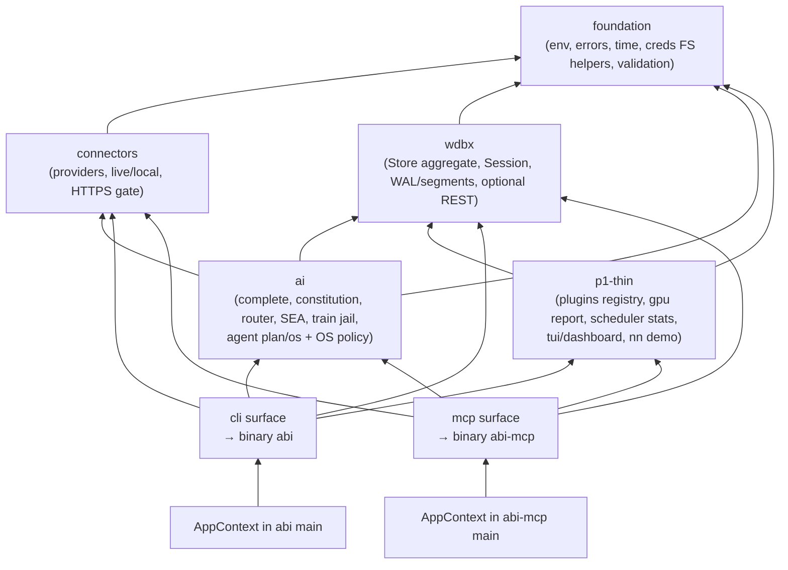

# Reimagined Architecture — `src` (focused modular monorepo)

> **Vision:** Simplify and focus the codebase while preserving frozen CLI/MCP *contracts*, single-node durable WDBX, and AI/SEA behavior.  
> **Spec:** [`AI_NATIVE_SPEC.md`](./AI_NATIVE_SPEC.md) (Phase B P0 recorded).  
> **Style:** Two process binaries (`abi`, `abi-mcp`) over in-process Zig modules — **not** a microservice mesh.  
> **Critique incorporated:** architecture-critic findings (blockers B1–B3, majors M1–M7, simpler alternative).

**Phase D approval:** _approved 2026-07-16 — minimal `modernized/packages/*` pointer scaffold only; live code remains `src/` until cutover_

---

## 1. Design principles

1. **Delete / stub / stop claiming** over package renames. Simplification = remove deferred product surface, not invent `platform-kit`.
2. **Frozen surfaces always exist.** Compile-out of features returns stable empty/disabled payloads; never remove a command or MCP tool without a contract change + HITL.
3. **One Runtime per process.** Ambient Session + Scheduler live in composition root (`main`), not domain globals shared ad hoc.
4. **Full single-node Store aggregate** for P0 (KV, HNSW 128d, block chain, temporal, spatial). Drop *modules* (cluster product, FHE demos, remote compute), not Store shape.
5. **Domain packages never import surfaces.** Surfaces compose domains.

---

## 2. Module dependency DAG (not C4 “containers”)



### Process composition

| Binary | Composition root owns | Passes into handlers |
|--------|----------------------|----------------------|
| `abi` | `AppContext` { allocator, io?, Session?, Scheduler?, metrics? } | CLI handlers receive `*AppContext` |
| `abi-mcp` | Same shape; Session ambient for tools | MCP tools receive `*AppContext` |

**Rules:**
- **One Session per process** for a given durable path.
- Domain packages accept `*Store` / context; they do **not** open a second durable Session on the same path.
- Concurrent durable open by a second process: **exclusive lock file** on open (fail fast exit 1 with clear message). Documented non-goal: multi-process multi-writer.
- MCP HTTP concurrency: Store mutations serialized under Session lock (or single-threaded accept loop — pick one, document it).

---

## 3. Module boundaries (rules & entities)

| Module | Owns | P0 rules (representative) | Depends on |
|--------|------|---------------------------|------------|
| **foundation** | env, errors, time, credential path helpers, path validation | BR-116–118 (path/modes), shared validation | — |
| **connectors** | ConnectorConfig, provider clients, transport `.local`/`.live`, HTTPS-only | BR-096–115, BR-125, BR-156, BR-166 | foundation |
| **wdbx** | Full **Store**: KV, HNSW 128d, BlockChain, Temporal, Spatial; Session; WAL; segments; optional loopback REST | BR-076–082 (quorum code may remain private), BR-087–093, REST BR-078–080, BR-149 (REST bind) | foundation |
| **ai** | Profiles, models, completion, constitution, AdaptiveModulator, SEA loop, training confinement, agent plan/multi/spawn/browser-plan, **OS policy** | BR-046–075, BR-011–014, BR-058–065, BR-126–135, BR-151 | foundation, connectors, wdbx |
| **p1-thin** | Plugin registry (build-time + list/run), GPU capabilities report, scheduler counters, TUI/dashboard, **nn** local demo | BR-016–018, BR-136–148, BR-161–164; MCP tools always advertised | foundation, wdbx (stats) |
| **cli** | Frozen 13 commands, exit 0/1/2, help/json/completion | BR-001–020, BR-160 | ai, wdbx, connectors, p1-thin |
| **mcp** | Protocol limits, 12 tools, stdio + loopback HTTP/SSE, stable errors | BR-021–040, BR-033–038, BR-149, BR-152, BR-155 | ai, wdbx, connectors, p1-thin |

### Explicit P0 decisions from critique

| Topic | Decision |
|-------|----------|
| **nn (B1)** | Keep `abi nn` as **thin local demo** in p1-thin / optional `-Dfeat-nn`. Not a service. Frozen command stays. |
| **Store aggregate (B2)** | Full C4.1 aggregate for P0. Delete cluster *product API*, remote_compute, fhe/crypto_he demos as public surfaces. |
| **Globals (B3)** | `AppContext` in each `main` only. No package-level ambient Session singleton. |
| **OS policy (M1)** | Lives in **ai** (agent safety), not a kitchen-sink platform kit. |
| **contracts package (M2)** | **Does not exist.** BR IDs live in acceptance tests. MCP/CLI tables are executable source of truth. Optional OpenAPI generated *from* code later (one direction). |
| **platform-kit (M1/m1)** | **Does not exist.** |
| **Live providers** | Network product path: Anthropic solid first. `auth signin` + `connector_test` still cover openai/discord/twilio/grok with **local** deterministic paths. |
| **Apple FM** | Keep optional `libabi_fm_shim` build product; `--confirm` required (BR-010). |
| **Cluster CLI** | Hard-refuse or remove from usage **with contract update** in same change. Default: `wdbx cluster *` → clear “not supported in this build” + exit 2 (or drop subcommands after contract suite update). Prefer refuse first to minimize surface churn. |
| **Feature flags** | Keep: ai, wdbx, sea, os-control, tui, gpu, metrics, plugins, nn, foundationmodels. Drop *product* flags/modules: cluster serve as supported product, remote-compute, fhe demos, shader/mlir/mobile/accelerator as first-class product (compile-out or leave dormant stubs if parity demands — prefer delete if unused by frozen surface). |
| **Public API** | `root.zig` re-exports only domains MCP + tests need. Surfaces are binaries. Domains never import cli/mcp. |

---

## 4. Technology choices

| Choice | Justification |
|--------|---------------|
| **Zig 0.17 (pinned)** | Matches `.zigversion`, contract tests, and Metal/FM build path — one toolchain beats polyglot rewrite for “simplify” |
| **In-process modules, 2 binaries** | Same ops surface as today; no new network topology for P0 |
| **Filesystem WAL + segments** | Proven durability model; byte-compatible migration |
| **Exclusive lock on durable open** | Prevents dual-writer WAL corruption between `abi` and `abi-mcp` |
| **HTTPS + explicit `.live`** | Preserve C5/C7 security rules |
| **Acceptance tests keyed by BR-*** | Spec §5 is the contract; implement P0 BR subset first, all frozen tools/commands always green |
| **No new DB / no k8s** | Out of Phase B scope |

---

## 5. Interface ownership

| Interface | Owner module | Notes |
|-----------|--------------|-------|
| CLI argv (13 cmds) | cli | Exit codes owned by surface |
| MCP stdio / HTTP loopback | mcp | 64 KiB, depth 32, optional `${ABI_MCP_HTTP_TOKEN}` |
| WDBX REST loopback | wdbx | Optional; 64 KiB; `${ABI_WDBX_REST_TOKEN}` |
| Credentials FS | foundation + cli auth + connectors | Path resolution in foundation; CLI writes; connectors read |
| Durable WDBX FS | wdbx | `${ABI_WDBX_PATH}`, `${ABI_WDBX_PERSIST}` |
| Anthropic live HTTPS | connectors + ai/cli complete path | C3.4 |
| OS process spawn | ai (policy) + cli agent os | Default dry-run; `--confirm` |
| Cluster TCP | **unsupported product** | Refuse or strip with contracts |
| Remote compute TCP | **deleted** | — |
| FHE/secure demos | **deleted as product APIs** | — |

---

## 6. Data migration

| Data | Approach |
|------|----------|
| Credentials JSON | Same keys/path env — copy-compatible |
| WDBX segments + WAL | **P0 = byte-compatible** read/write (`ABI-WDBX-WAL v1`, segment manifest). Acceptance: open legacy fixture → query → append → reopen |
| Migrate tool | Only if format bump forced — **not** a P0 deliverable |
| Cluster state | None (product dropped) |
| Training artifacts | Unchanged path-jail rules under `${ABI_TRAIN_DATA_ROOT}` |
| Dual-process | Exclusive lock; no silent durable→memory fallback on open failure for operator paths — log + fail or require explicit `:memory:` |

---

## 7. P0 capability → module → test home

| Cap | Module(s) | Acceptance focus |
|-----|-----------|------------------|
| C1.1–C1.4 AI/SEA/train | ai + wdbx | BR-046–075, BR-058–061 |
| C1.5 agent surfaces | ai + cli | BR-013–014, BR-064–065 |
| C1.6 nn | p1-thin + cli | BR-162–164 (thin demo) |
| C2 MCP | mcp | BR-021–040 |
| C3 CLI | cli | BR-001–020, BR-160 |
| C4 single-node WDBX | wdbx | BR-076–080, BR-087–093 |
| C5 auth/connectors | foundation, connectors, cli | BR-096–125 |
| C6 plugins/gpu/sched/tui | p1-thin | BR-016–018, BR-136–148 (thin) |
| C7 safety | ai, mcp, wdbx, connectors | BR-126–135, BR-149–159 |

**Day-one test bar:** every frozen command and every MCP tool has at least one green acceptance path (real or stub payload). Full BR-001–166 suite is the backlog, not the scaffold gate.

---

## 8. Target tree (scaffold layout — after Phase D approval only)

```text
modernized/src-reimagined/
  CLAUDE.md                 # knowledge graph (Phase F)
  foundation/               # leaf
  connectors/
  wdbx/
  ai/
  p1-thin/                  # plugins, gpu, scheduler, tui, nn
  cli/                      # → app abi
  mcp/                      # → app abi-mcp
  tests/
    acceptance/             # BR-* keyed
    fixtures/               # legacy WAL/segment samples (no secrets)
```

Each service/package scaffold: project skeleton, domain model stubs, API stubs matching contracts, executable acceptance tests (unimplemented → expected-fail/skip with rule ID). No credential literals — fake same-shape values and `${ENV}` placeholders only.

**Scaffold unit count (Phase E):** 6 packages + 2 surface apps treated as **6 scaffold targets** (foundation, connectors, wdbx, ai, p1-thin, surfaces-cli-mcp combined) — or 7 if cli/mcp split. Cap note: without Workflow tool, fallback scaffolds ≤3 parallel first (wdbx, ai, mcp) and defer the rest.

---

## 9. Explicit non-goals (P0)

- Microservice mesh / Kubernetes  
- Multi-host cluster as supported product  
- Remote compute service  
- nn as a *service* (CLI demo kept)  
- FHE / production crypto product claims  
- Expanding live CLI to all providers before Anthropic path is solid  
- Published QPS/latency SLAs  
- Separate `contracts` or `platform-kit` packages  
- Shared mutable domain globals  
- Concurrent multi-process writers on one WDBX path  

---

## 10. Critique changelog (what we rejected / kept)

| Proposal draft | Critic | Outcome |
|----------------|--------|---------|
| 7 packages + contracts + platform-kit | Over-engineered | **Cut** to foundation + 3 domains + p1-thin + 2 surfaces |
| C4 Container diagram | Misleading | **Module DAG** + two process roots |
| Drop nn flag | Breaks frozen CLI | **Keep** nn as thin demo |
| Reduced Store | Breaks SEA/C4.1 | **Full Store aggregate** |
| No globals | Collides with MCP ambient | **`AppContext` in main** |
| OS policy in platform-kit | Wrong home | **ai module** |
| OpenAPI as source of truth | Dual-source | **Tests + executable tables** |
| No dual-writer story | Data loss risk | **Exclusive lock + document** |

---

## 11. Risks remaining (accepted for P0)

| Risk | Mitigation |
|------|------------|
| Unbounded Store growth | SEA budgets retained; operator manages disk; truthful `wdbx_stats` |
| HTTP tool concurrency | Session lock or single-thread accept (document choice at implement) |
| Flag shrink vs parity | Stubs for disabled features; never silent tool removal |
| Cluster subcommand confusion | Hard-refuse message until contract unfreezes drop |

---

## 12. Next step

**Phase D HITL:** Approve this architecture (or request changes).  
Scaffolding (`modernized/src-reimagined/**`) starts **only** after explicit approval.
