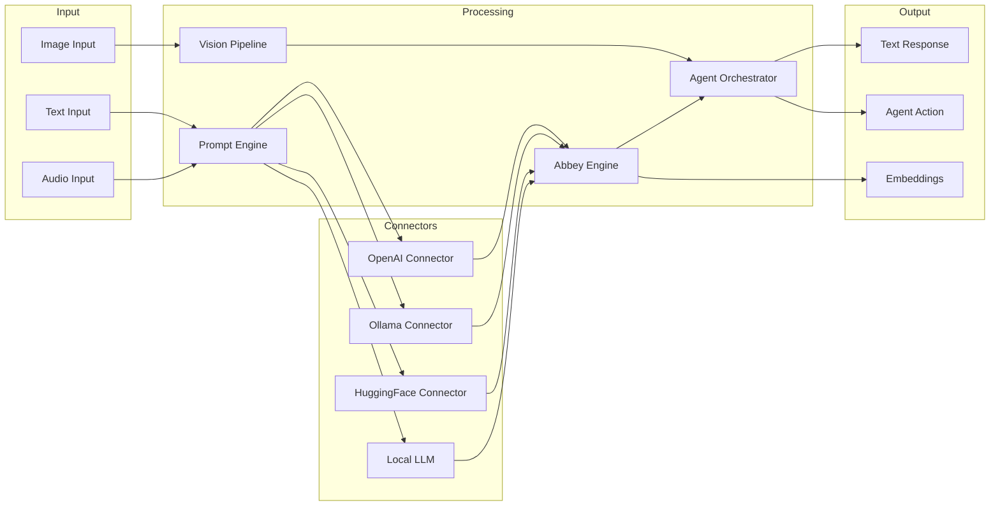

# AI Module Data Flow
> **Codebase Status:** Synced with repository as of 2026-01-30.

## Component Responsibilities

| Component | Description |
|-----------|-------------|
| Connectors | External API integrations (OpenAI, Ollama, HuggingFace) |
| Prompt Engine | Template management and prompt construction |
| Abbey Engine | Core LLM inference and response handling |
| Vision Pipeline | Image processing and feature extraction |
| Agent Orchestrator | Multi-agent coordination and task decomposition |

## Environment Variables

| Variable | Purpose |
|----------|---------|
| `ABI_OPENAI_API_KEY` | OpenAI authentication |
| `ABI_OLLAMA_HOST` | Ollama server endpoint |
| `ABI_HF_API_TOKEN` | HuggingFace API access |

