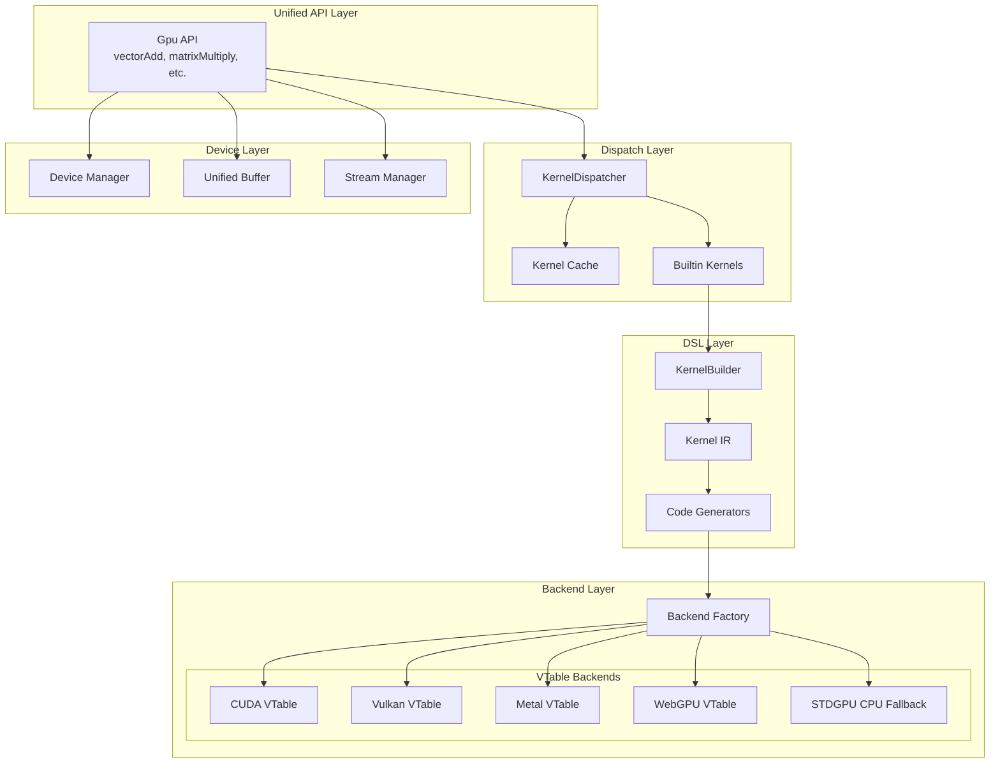

# GPU Architecture Diagram
> **Codebase Status:** Synced with repository as of 2026-01-18.

## Components

| Component | File | Description |
|-----------|------|-------------|
| Gpu API | `unified.zig` | High-level unified interface |
| KernelDispatcher | `dispatcher.zig` | Routes kernels to backends |
| Builtin Kernels | `builtin_kernels.zig` | Pre-defined kernel IR |
| KernelBuilder | `dsl/builder.zig` | Fluent API for kernel construction |
| Backend Factory | `backend_factory.zig` | Creates VTable backends |
| Device Manager | `device.zig` | Device discovery and selection |
| Unified Buffer | `unified_buffer.zig` | Memory management across backends |
