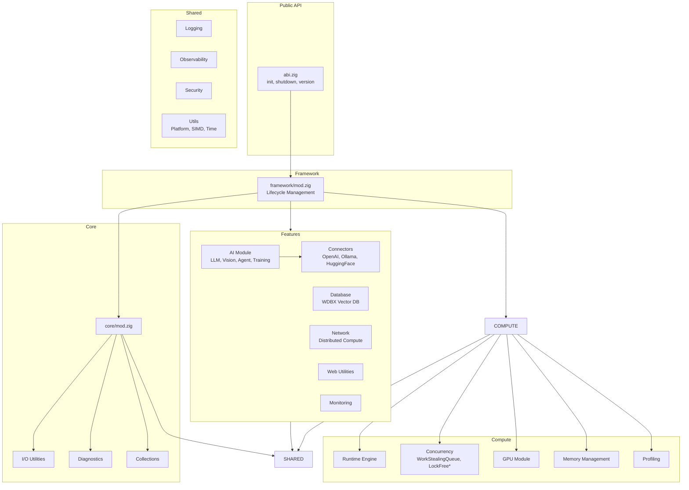

# ABI System Architecture
> **Codebase Status:** Synced with repository as of 2026-01-18.



## Layer Descriptions

| Layer | Purpose |
|-------|---------|
| Public API | Single entry point (`abi.zig`) for all functionality |
| Framework | Lifecycle management, feature orchestration |
| Core | Fundamental utilities: I/O, diagnostics, collections |
| Compute | High-performance runtime, concurrency, GPU, profiling |
| Features | Domain-specific: AI, Database, Network, Web, Monitoring |
| Shared | Cross-cutting: logging, security, platform abstractions |

## Feature Gating

All features use compile-time gating via build options:

```zig
const impl = if (build_options.enable_feature)
    @import("real.zig")
else
    @import("stub.zig");
```

Disabled features return `error.<Feature>Disabled`.
