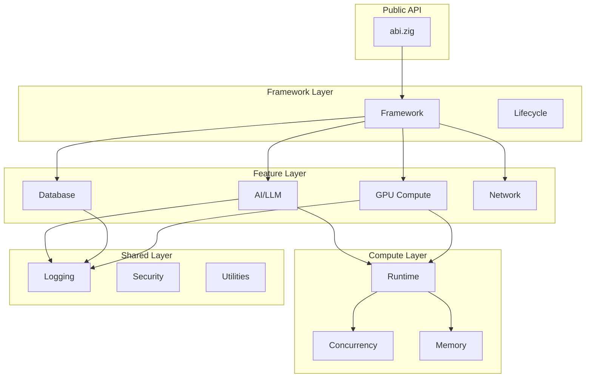
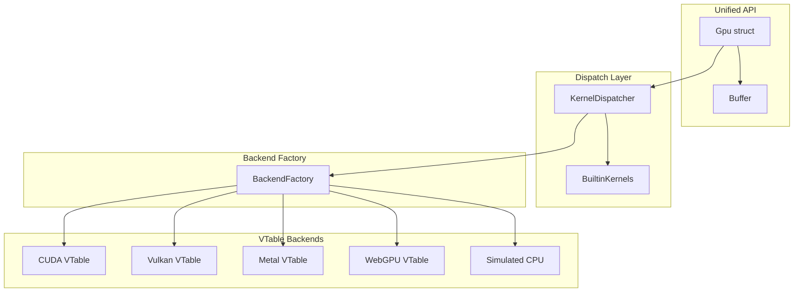
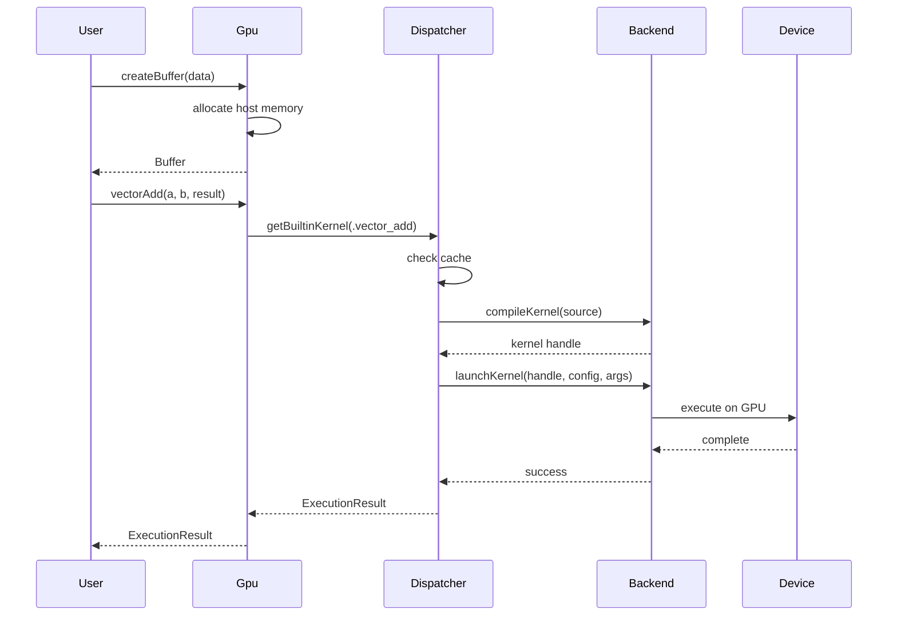

# Comprehensive Roadmap Implementation Plan

> **For Claude:** REQUIRED SUB-SKILL: Use superpowers:executing-plans to implement this plan task-by-task.

**Goal:** Complete all open ROADMAP items through Q3 2026, including GPU Phase 3 refactor, documentation infrastructure, competitive benchmarks, high availability features, and ecosystem packaging.

**Architecture:** Modular implementation in 5 phases - GPU completion, documentation tooling, benchmark framework, HA infrastructure, and packaging/distribution. Each phase is independent and can be executed in parallel.

**Tech Stack:** Zig 0.16, Docker, GitHub Actions, autodoc tooling, Prometheus metrics

---

## Phase 1: GPU Modular Refactor (Phase 3 Completion)

### Task 1.1: Create Dispatcher Integration for unified.zig

**Files:**
- Modify: `src/compute/gpu/unified.zig:206-320` (Gpu struct init)
- Modify: `src/compute/gpu/unified.zig:476-514` (vectorAdd)
- Reference: `src/compute/gpu/dispatcher.zig`

**Step 1: Add dispatcher field to Gpu struct**

In `src/compute/gpu/unified.zig`, add the dispatcher import and field:

```zig
// Add import after line 41
const dispatcher_mod = @import("dispatcher.zig");
pub const KernelDispatcher = dispatcher_mod.KernelDispatcher;
```

Add field to Gpu struct (after line 229):
```zig
    // Kernel dispatcher for backend execution
    dispatcher: ?KernelDispatcher,
```

**Step 2: Initialize dispatcher in Gpu.init**

In `Gpu.init()` around line 278, add dispatcher initialization:

```zig
        // Initialize kernel dispatcher for active device
        var dispatcher: ?KernelDispatcher = null;
        if (active_device) |device| {
            dispatcher = KernelDispatcher.init(allocator, device.backend, device) catch null;

            // Connect to backend factory if available
            if (dispatcher) |*d| {
                const backend_factory = @import("backend_factory.zig");
                if (backend_factory.createVTableBackend(allocator, device.backend)) |bi| {
                    d.setBackendInterface(bi);
                } else |_| {}
            }
        }
```

Update the return struct to include dispatcher field.

**Step 3: Update deinit to cleanup dispatcher**

In `Gpu.deinit()` around line 316, add:
```zig
        // Clean up dispatcher
        if (self.dispatcher) |*d| {
            d.deinit();
        }
```

**Step 4: Run build to verify compilation**

Run: `zig build`
Expected: Build succeeds with no errors

**Step 5: Commit**

```bash
git add src/compute/gpu/unified.zig
git commit -m "feat(gpu): add KernelDispatcher to unified GPU API"
```

---

### Task 1.2: Integrate Dispatcher into vectorAdd

**Files:**
- Modify: `src/compute/gpu/unified.zig:476-514` (vectorAdd method)

**Step 1: Update vectorAdd to use dispatcher**

Replace the vectorAdd implementation (lines 478-513) with:

```zig
    /// Vector addition: result = a + b
    pub fn vectorAdd(self: *Gpu, a: *Buffer, b: *Buffer, result: *Buffer) !ExecutionResult {
        const device = self.active_device orelse return error.NoActiveDevice;

        var timer = std.time.Timer.start() catch return error.TimerFailed;

        // Try dispatcher-based execution first
        if (self.dispatcher) |*disp| {
            const kernel = disp.getBuiltinKernel(.vector_add) catch null;
            if (kernel) |k| {
                const config = dispatcher_mod.LaunchConfig.for1D(a.elementCount(), 256);
                const exec_result = disp.execute(k, config, .{
                    .buffers = &.{ a, b, result },
                }) catch null;

                if (exec_result) |res| {
                    self.stats.kernels_launched += 1;
                    self.stats.total_execution_time_ns += res.execution_time_ns;

                    if (self.metrics) |*m| {
                        m.recordKernel("vectorAdd", res.execution_time_ns) catch {};
                    }

                    return ExecutionResult{
                        .execution_time_ns = res.execution_time_ns,
                        .elements_processed = res.elements_processed,
                        .bytes_transferred = res.bytes_transferred,
                        .backend = device.backend,
                        .device_id = device.id,
                    };
                }
            }
        }

        // Fallback to host computation
        if (a.host_data != null and b.host_data != null and result.host_data != null) {
            const a_data = std.mem.bytesAsSlice(f32, a.host_data.?);
            const b_data = std.mem.bytesAsSlice(f32, b.host_data.?);
            var r_data = std.mem.bytesAsSlice(f32, result.host_data.?);

            const len = @min(a_data.len, @min(b_data.len, r_data.len));
            for (0..len) |i| {
                r_data[i] = a_data[i] + b_data[i];
            }

            result.markHostDirty();
        }

        const elapsed = timer.read();
        self.stats.kernels_launched += 1;
        self.stats.total_execution_time_ns += elapsed;

        if (self.metrics) |*m| {
            m.recordKernel("vectorAdd", elapsed) catch {};
        }

        return ExecutionResult{
            .execution_time_ns = elapsed,
            .elements_processed = a.elementCount(),
            .bytes_transferred = a.getSize() + b.getSize() + result.getSize(),
            .backend = device.backend,
            .device_id = device.id,
        };
    }
```

**Step 2: Run tests to verify**

Run: `zig build test --summary all`
Expected: All 51+ tests pass

**Step 3: Commit**

```bash
git add src/compute/gpu/unified.zig
git commit -m "feat(gpu): integrate dispatcher into vectorAdd with fallback"
```

---

### Task 1.3: Integrate Dispatcher into Remaining Operations

**Files:**
- Modify: `src/compute/gpu/unified.zig:516-688` (matrixMultiply, reduceSum, dotProduct, softmax)

**Step 1: Update matrixMultiply**

Apply same pattern as vectorAdd - try dispatcher first, fallback to host computation.

**Step 2: Update reduceSum**

Apply same pattern with `.reduce_sum` builtin kernel.

**Step 3: Update dotProduct**

Apply same pattern with `.dot_product` builtin kernel.

**Step 4: Update softmax**

Apply same pattern with `.softmax` builtin kernel.

**Step 5: Run tests**

Run: `zig build test --summary all`
Expected: All tests pass

**Step 6: Commit**

```bash
git add src/compute/gpu/unified.zig
git commit -m "feat(gpu): integrate dispatcher into all GPU operations"
```

---

### Task 1.4: Reduce mod.zig Exports

**Files:**
- Modify: `src/compute/gpu/mod.zig`

**Step 1: Audit current exports**

Read `src/compute/gpu/mod.zig` and identify:
- Public API exports (keep)
- Internal implementation details (make private or remove)

**Step 2: Organize exports into categories**

```zig
//! GPU Compute Module
//!
//! ## Public API
//! - `Gpu` - Main unified GPU interface
//! - `Backend` - Backend type enum
//! - `Device` - Device information
//!
//! ## Internal (use with caution)
//! - `KernelDispatcher` - Low-level kernel dispatch
//! - `BackendFactory` - Backend instantiation

// Public API
pub const unified = @import("unified.zig");
pub const Gpu = unified.Gpu;
pub const Backend = @import("backend.zig").Backend;
pub const Device = @import("device.zig").Device;

// Re-export common types
pub const Buffer = unified.Buffer;
pub const BufferOptions = unified.BufferOptions;
pub const ExecutionResult = unified.ExecutionResult;
pub const GpuConfig = unified.GpuConfig;

// Internal modules (explicitly marked)
pub const internal = struct {
    pub const dispatcher = @import("dispatcher.zig");
    pub const backend_factory = @import("backend_factory.zig");
    pub const builtin_kernels = @import("builtin_kernels.zig");
};
```

**Step 3: Update dependent imports**

Search for any code importing removed exports and update paths.

**Step 4: Run build and tests**

Run: `zig build test --summary all`
Expected: All tests pass

**Step 5: Commit**

```bash
git add src/compute/gpu/mod.zig
git commit -m "refactor(gpu): organize exports with clear public/internal separation"
```

---

### Task 1.5: Update Plan Document

**Files:**
- Modify: `docs/plans/2026-01-17-modular-codebase-refactor.md`

**Step 1: Mark Phase 3 complete**

Update status to "Complete (Phase 1, 2 & 3)" and check off remaining items.

**Step 2: Commit**

```bash
git add docs/plans/2026-01-17-modular-codebase-refactor.md
git commit -m "docs: mark GPU modular refactor Phase 3 complete"
```

---

## Phase 2: Documentation Infrastructure

### Task 2.1: Create API Documentation Generator Script

**Files:**
- Create: `tools/gendocs.zig`
- Create: `docs/api/README.md`

**Step 1: Create documentation generator**

```zig
//! API Documentation Generator
//!
//! Generates markdown documentation from Zig doc comments.
//! Usage: zig build run-gendocs

const std = @import("std");

pub fn main() !void {
    var gpa = std.heap.GeneralPurposeAllocator(.{}){};
    defer _ = gpa.deinit();
    const allocator = gpa.allocator();

    const args = try std.process.argsAlloc(allocator);
    defer std.process.argsFree(allocator, args);

    const output_dir = if (args.len > 1) args[1] else "docs/api";

    // Generate docs for main modules
    const modules = [_][]const u8{
        "src/abi.zig",
        "src/compute/gpu/unified.zig",
        "src/features/ai/mod.zig",
        "src/features/database/mod.zig",
    };

    for (modules) |module| {
        try generateModuleDoc(allocator, module, output_dir);
    }

    std.debug.print("Documentation generated in {s}\n", .{output_dir});
}

fn generateModuleDoc(allocator: std.mem.Allocator, module_path: []const u8, output_dir: []const u8) !void {
    // Read source file
    const source = std.fs.cwd().readFileAlloc(allocator, module_path, 1024 * 1024) catch |err| {
        std.debug.print("Warning: Could not read {s}: {}\n", .{ module_path, err });
        return;
    };
    defer allocator.free(source);

    // Extract module name
    const basename = std.fs.path.basename(module_path);
    const name = std.mem.sliceTo(basename, '.');

    // Create output file
    const output_path = try std.fmt.allocPrint(allocator, "{s}/{s}.md", .{ output_dir, name });
    defer allocator.free(output_path);

    var file = try std.fs.cwd().createFile(output_path, .{});
    defer file.close();

    var writer = file.writer();

    // Write header
    try writer.print("# {s} Module\n\n", .{name});
    try writer.print("**Source:** `{s}`\n\n", .{module_path});

    // Extract and write doc comments
    try extractDocComments(source, writer);
}

fn extractDocComments(source: []const u8, writer: anytype) !void {
    var lines = std.mem.splitScalar(u8, source, '\n');
    var in_doc_block = false;

    while (lines.next()) |line| {
        const trimmed = std.mem.trim(u8, line, " \t");

        if (std.mem.startsWith(u8, trimmed, "//!")) {
            // Module-level doc comment
            const content = if (trimmed.len > 3) trimmed[3..] else "";
            try writer.print("{s}\n", .{std.mem.trim(u8, content, " ")});
            in_doc_block = true;
        } else if (std.mem.startsWith(u8, trimmed, "///")) {
            // Item-level doc comment
            const content = if (trimmed.len > 3) trimmed[3..] else "";
            try writer.print("{s}\n", .{std.mem.trim(u8, content, " ")});
        } else if (in_doc_block and trimmed.len == 0) {
            try writer.writeAll("\n");
        } else {
            in_doc_block = false;
        }
    }
}
```

**Step 2: Add build target**

In `build.zig`, add:
```zig
const gendocs = b.addExecutable(.{
    .name = "gendocs",
    .root_source_file = b.path("tools/gendocs.zig"),
    .target = target,
    .optimize = optimize,
});
const run_gendocs = b.addRunArtifact(gendocs);
const gendocs_step = b.step("gendocs", "Generate API documentation");
gendocs_step.dependOn(&run_gendocs.step);
```

**Step 3: Create docs/api directory structure**

```bash
mkdir -p docs/api
```

**Step 4: Run and verify**

Run: `zig build gendocs`
Expected: Documentation files created in docs/api/

**Step 5: Commit**

```bash
git add tools/gendocs.zig docs/api/
git commit -m "feat(docs): add API documentation generator"
```

---

### Task 2.2: Create Architecture Diagram Sources

**Files:**
- Create: `docs/diagrams/system-architecture.md`
- Create: `docs/diagrams/gpu-architecture.md`
- Create: `docs/diagrams/data-flow.md`

**Step 1: Create system architecture diagram (Mermaid)**

```markdown
# System Architecture


```

**Step 2: Create GPU architecture diagram**

```markdown
# GPU Architecture


```

**Step 3: Create data flow diagram**

```markdown
# Data Flow


```

**Step 4: Commit**

```bash
git add docs/diagrams/
git commit -m "docs: add architecture diagrams in Mermaid format"
```

---

## Phase 3: Competitive Benchmark Framework

### Task 3.1: Create Benchmark Runner Infrastructure

**Files:**
- Create: `benchmarks/competitive/runner.zig`
- Create: `benchmarks/competitive/baselines.json`

**Step 1: Create benchmark runner**

```zig
//! Competitive Benchmark Runner
//!
//! Compares ABI performance against reference implementations.

const std = @import("std");
const abi = @import("abi");

pub const BenchmarkResult = struct {
    name: []const u8,
    abi_time_ns: u64,
    baseline_time_ns: ?u64,
    elements: usize,
    throughput_gbps: f64,
    speedup: ?f64,

    pub fn format(self: BenchmarkResult, writer: anytype) !void {
        try writer.print("{s:<30} ", .{self.name});
        try writer.print("{d:>10.2} ms ", .{@as(f64, @floatFromInt(self.abi_time_ns)) / 1_000_000.0});
        try writer.print("{d:>8.2} GB/s ", .{self.throughput_gbps});
        if (self.speedup) |s| {
            try writer.print("{d:>6.2}x", .{s});
        }
        try writer.writeAll("\n");
    }
};

pub const BenchmarkSuite = struct {
    allocator: std.mem.Allocator,
    results: std.ArrayListUnmanaged(BenchmarkResult),
    baselines: std.json.ObjectMap,

    pub fn init(allocator: std.mem.Allocator) !BenchmarkSuite {
        // Load baselines from JSON
        var baselines = std.json.ObjectMap.init(allocator);

        const baseline_path = "benchmarks/competitive/baselines.json";
        if (std.fs.cwd().readFileAlloc(allocator, baseline_path, 1024 * 1024)) |content| {
            defer allocator.free(content);
            if (std.json.parseFromSlice(std.json.Value, allocator, content, .{})) |parsed| {
                if (parsed.value == .object) {
                    baselines = parsed.value.object;
                }
            } else |_| {}
        } else |_| {}

        return .{
            .allocator = allocator,
            .results = .empty,
            .baselines = baselines,
        };
    }

    pub fn deinit(self: *BenchmarkSuite) void {
        self.results.deinit(self.allocator);
    }

    pub fn run(self: *BenchmarkSuite, name: []const u8, func: *const fn () u64, elements: usize, bytes: usize) !void {
        // Warmup
        _ = func();
        _ = func();

        // Measure
        const iterations = 10;
        var total_ns: u64 = 0;

        for (0..iterations) |_| {
            total_ns += func();
        }

        const avg_ns = total_ns / iterations;
        const throughput = @as(f64, @floatFromInt(bytes)) / (@as(f64, @floatFromInt(avg_ns)) / 1_000_000_000.0) / (1024 * 1024 * 1024);

        var baseline_ns: ?u64 = null;
        var speedup: ?f64 = null;

        if (self.baselines.get(name)) |b| {
            if (b == .integer) {
                baseline_ns = @intCast(b.integer);
                speedup = @as(f64, @floatFromInt(baseline_ns.?)) / @as(f64, @floatFromInt(avg_ns));
            }
        }

        try self.results.append(self.allocator, .{
            .name = name,
            .abi_time_ns = avg_ns,
            .baseline_time_ns = baseline_ns,
            .elements = elements,
            .throughput_gbps = throughput,
            .speedup = speedup,
        });
    }

    pub fn printReport(self: *const BenchmarkSuite) void {
        std.debug.print("\n{'='*60}\n", .{});
        std.debug.print("ABI Competitive Benchmark Report\n", .{});
        std.debug.print("{'='*60}\n\n", .{});

        std.debug.print("{s:<30} {s:>12} {s:>10} {s:>8}\n", .{ "Benchmark", "Time", "Throughput", "Speedup" });
        std.debug.print("{'-'*60}\n", .{});

        for (self.results.items) |result| {
            result.format(std.io.getStdErr().writer()) catch {};
        }
    }
};
```

**Step 2: Create baselines JSON**

```json
{
    "vector_add_1m": 500000,
    "matrix_multiply_1k": 50000000,
    "reduce_sum_1m": 200000,
    "softmax_64k": 100000
}
```

**Step 3: Commit**

```bash
git add benchmarks/competitive/
git commit -m "feat(bench): add competitive benchmark framework"
```

---

### Task 3.2: Implement Vector Operation Benchmarks

**Files:**
- Create: `benchmarks/competitive/vector_ops.zig`

**Step 1: Create vector benchmarks**

```zig
//! Vector Operation Benchmarks

const std = @import("std");
const abi = @import("abi");
const runner = @import("runner.zig");

pub fn runVectorBenchmarks(suite: *runner.BenchmarkSuite, gpu: *abi.Gpu) !void {
    // 1M element vector add
    const size_1m = 1_000_000;
    var a_data: [size_1m]f32 = undefined;
    var b_data: [size_1m]f32 = undefined;

    // Initialize with random data
    var prng = std.Random.DefaultPrng.init(42);
    const random = prng.random();
    for (0..size_1m) |i| {
        a_data[i] = random.float(f32);
        b_data[i] = random.float(f32);
    }

    const a = try gpu.createBufferFromSlice(f32, &a_data, .{});
    defer gpu.destroyBuffer(a);
    const b = try gpu.createBufferFromSlice(f32, &b_data, .{});
    defer gpu.destroyBuffer(b);
    const result = try gpu.createBuffer(size_1m * @sizeOf(f32), .{});
    defer gpu.destroyBuffer(result);

    try suite.run("vector_add_1m", struct {
        fn bench() u64 {
            var timer = std.time.Timer.start() catch return 0;
            _ = gpu.vectorAdd(a, b, result) catch {};
            return timer.read();
        }
    }.bench, size_1m, size_1m * @sizeOf(f32) * 3);
}

pub fn main() !void {
    var gpa = std.heap.GeneralPurposeAllocator(.{}){};
    defer _ = gpa.deinit();
    const allocator = gpa.allocator();

    var suite = try runner.BenchmarkSuite.init(allocator);
    defer suite.deinit();

    var gpu = try abi.Gpu.init(allocator, .{});
    defer gpu.deinit();

    if (!gpu.isAvailable()) {
        std.debug.print("No GPU available, skipping benchmarks\n", .{});
        return;
    }

    try runVectorBenchmarks(&suite, &gpu);

    suite.printReport();
}
```

**Step 2: Commit**

```bash
git add benchmarks/competitive/vector_ops.zig
git commit -m "feat(bench): add vector operation benchmarks"
```

---

## Phase 4: High Availability Infrastructure

### Task 4.1: Create Automatic Failover Manager

**Files:**
- Create: `src/features/network/failover.zig`
- Modify: `src/features/network/mod.zig`

**Step 1: Create failover manager**

```zig
//! Automatic Failover Manager
//!
//! Monitors node health and triggers automatic failover when primary fails.

const std = @import("std");
const loadbalancer = @import("loadbalancer.zig");

pub const FailoverConfig = struct {
    /// Health check interval in milliseconds.
    health_check_interval_ms: u64 = 5000,
    /// Number of failed checks before triggering failover.
    failure_threshold: u32 = 3,
    /// Timeout for health checks in milliseconds.
    health_check_timeout_ms: u64 = 2000,
    /// Enable automatic failover.
    auto_failover: bool = true,
};

pub const FailoverState = enum {
    normal,
    monitoring,
    failing_over,
    failed_over,
    recovering,
};

pub const FailoverEvent = struct {
    timestamp_ms: i64,
    event_type: EventType,
    node_id: []const u8,
    details: ?[]const u8,

    pub const EventType = enum {
        health_check_failed,
        failover_started,
        failover_completed,
        recovery_started,
        recovery_completed,
    };
};

pub const FailoverManager = struct {
    allocator: std.mem.Allocator,
    config: FailoverConfig,
    state: FailoverState,
    primary_node: ?[]const u8,
    secondary_nodes: std.ArrayListUnmanaged([]const u8),
    failure_counts: std.StringHashMapUnmanaged(u32),
    event_log: std.ArrayListUnmanaged(FailoverEvent),
    mutex: std.Thread.Mutex,

    const Self = @This();

    pub fn init(allocator: std.mem.Allocator, config: FailoverConfig) Self {
        return .{
            .allocator = allocator,
            .config = config,
            .state = .normal,
            .primary_node = null,
            .secondary_nodes = .empty,
            .failure_counts = .empty,
            .event_log = .empty,
            .mutex = .{},
        };
    }

    pub fn deinit(self: *Self) void {
        self.secondary_nodes.deinit(self.allocator);
        self.failure_counts.deinit(self.allocator);
        self.event_log.deinit(self.allocator);
    }

    pub fn setPrimary(self: *Self, node_id: []const u8) !void {
        self.mutex.lock();
        defer self.mutex.unlock();
        self.primary_node = try self.allocator.dupe(u8, node_id);
    }

    pub fn addSecondary(self: *Self, node_id: []const u8) !void {
        self.mutex.lock();
        defer self.mutex.unlock();
        const id = try self.allocator.dupe(u8, node_id);
        try self.secondary_nodes.append(self.allocator, id);
    }

    pub fn recordHealthCheckResult(self: *Self, node_id: []const u8, success: bool) !void {
        self.mutex.lock();
        defer self.mutex.unlock();

        if (success) {
            _ = self.failure_counts.remove(node_id);
            return;
        }

        // Increment failure count
        const entry = try self.failure_counts.getOrPut(self.allocator, node_id);
        if (entry.found_existing) {
            entry.value_ptr.* += 1;
        } else {
            entry.value_ptr.* = 1;
        }

        // Check if failover needed
        if (entry.value_ptr.* >= self.config.failure_threshold) {
            if (self.config.auto_failover and
                self.primary_node != null and
                std.mem.eql(u8, self.primary_node.?, node_id))
            {
                try self.triggerFailover(node_id);
            }
        }
    }

    fn triggerFailover(self: *Self, failed_node: []const u8) !void {
        self.state = .failing_over;

        try self.logEvent(.{
            .timestamp_ms = std.time.milliTimestamp(),
            .event_type = .failover_started,
            .node_id = failed_node,
            .details = "Primary node failed, initiating failover",
        });

        // Promote first available secondary
        if (self.secondary_nodes.items.len > 0) {
            const new_primary = self.secondary_nodes.orderedRemove(0);
            self.primary_node = new_primary;
            self.state = .failed_over;

            try self.logEvent(.{
                .timestamp_ms = std.time.milliTimestamp(),
                .event_type = .failover_completed,
                .node_id = new_primary,
                .details = "Promoted to primary",
            });
        } else {
            self.state = .normal; // No secondaries available
        }
    }

    fn logEvent(self: *Self, event: FailoverEvent) !void {
        try self.event_log.append(self.allocator, event);
    }

    pub fn getState(self: *Self) FailoverState {
        self.mutex.lock();
        defer self.mutex.unlock();
        return self.state;
    }

    pub fn getEventLog(self: *Self) []const FailoverEvent {
        self.mutex.lock();
        defer self.mutex.unlock();
        return self.event_log.items;
    }
};
```

**Step 2: Export from mod.zig**

Add to `src/features/network/mod.zig`:
```zig
pub const failover = @import("failover.zig");
pub const FailoverManager = failover.FailoverManager;
pub const FailoverConfig = failover.FailoverConfig;
```

**Step 3: Write test**

```zig
test "FailoverManager basic operations" {
    var fm = FailoverManager.init(std.testing.allocator, .{
        .failure_threshold = 2,
        .auto_failover = true,
    });
    defer fm.deinit();

    try fm.setPrimary("node-1");
    try fm.addSecondary("node-2");

    // First failure - no failover yet
    try fm.recordHealthCheckResult("node-1", false);
    try std.testing.expectEqual(FailoverState.normal, fm.getState());

    // Second failure - triggers failover
    try fm.recordHealthCheckResult("node-1", false);
    try std.testing.expectEqual(FailoverState.failed_over, fm.getState());
}
```

**Step 4: Run tests**

Run: `zig build test --summary all`
Expected: All tests pass including new failover test

**Step 5: Commit**

```bash
git add src/features/network/failover.zig src/features/network/mod.zig
git commit -m "feat(ha): add automatic failover manager"
```

---

### Task 4.2: Create Point-in-Time Recovery Foundation

**Files:**
- Create: `src/features/database/recovery.zig`

**Step 1: Create recovery manager**

```zig
//! Point-in-Time Recovery
//!
//! Enables database recovery to any point in time using WAL segments.

const std = @import("std");

pub const RecoveryPoint = struct {
    timestamp_ms: i64,
    wal_segment: u64,
    offset: u64,
    checksum: u32,
};

pub const RecoveryConfig = struct {
    /// Directory for WAL segments.
    wal_dir: []const u8 = "wal",
    /// Maximum WAL retention in hours.
    retention_hours: u32 = 168, // 7 days
    /// Segment size in bytes.
    segment_size: usize = 16 * 1024 * 1024, // 16MB
};

pub const RecoveryManager = struct {
    allocator: std.mem.Allocator,
    config: RecoveryConfig,
    recovery_points: std.ArrayListUnmanaged(RecoveryPoint),
    current_segment: u64,

    const Self = @This();

    pub fn init(allocator: std.mem.Allocator, config: RecoveryConfig) Self {
        return .{
            .allocator = allocator,
            .config = config,
            .recovery_points = .empty,
            .current_segment = 0,
        };
    }

    pub fn deinit(self: *Self) void {
        self.recovery_points.deinit(self.allocator);
    }

    pub fn createRecoveryPoint(self: *Self) !RecoveryPoint {
        const point = RecoveryPoint{
            .timestamp_ms = std.time.milliTimestamp(),
            .wal_segment = self.current_segment,
            .offset = 0, // Would be actual offset in production
            .checksum = 0, // Would be computed checksum
        };
        try self.recovery_points.append(self.allocator, point);
        return point;
    }

    pub fn findRecoveryPoint(self: *Self, target_timestamp_ms: i64) ?RecoveryPoint {
        // Find closest recovery point before target
        var best: ?RecoveryPoint = null;
        for (self.recovery_points.items) |point| {
            if (point.timestamp_ms <= target_timestamp_ms) {
                if (best == null or point.timestamp_ms > best.?.timestamp_ms) {
                    best = point;
                }
            }
        }
        return best;
    }

    pub fn recoverTo(self: *Self, point: RecoveryPoint) !void {
        _ = self;
        // In production: replay WAL from point.wal_segment:point.offset
        std.log.info("Recovering to segment {} offset {}", .{ point.wal_segment, point.offset });
    }

    pub fn listRecoveryPoints(self: *const Self) []const RecoveryPoint {
        return self.recovery_points.items;
    }
};
```

**Step 2: Commit**

```bash
git add src/features/database/recovery.zig
git commit -m "feat(ha): add point-in-time recovery foundation"
```

---

## Phase 5: Ecosystem Packaging

### Task 5.1: Create Dockerfile

**Files:**
- Create: `Dockerfile`
- Create: `.dockerignore`

**Step 1: Create Dockerfile**

```dockerfile
# ABI Framework Docker Image
# Multi-stage build for minimal image size

# Build stage
FROM debian:bookworm-slim AS builder

# Install Zig
RUN apt-get update && apt-get install -y \
    curl \
    xz-utils \
    && rm -rf /var/lib/apt/lists/*

ARG ZIG_VERSION=0.16.0
RUN curl -L https://ziglang.org/download/${ZIG_VERSION}/zig-linux-x86_64-${ZIG_VERSION}.tar.xz | tar -xJ -C /opt \
    && ln -s /opt/zig-linux-x86_64-${ZIG_VERSION}/zig /usr/local/bin/zig

# Build ABI
WORKDIR /build
COPY . .
RUN zig build -Doptimize=ReleaseFast

# Runtime stage
FROM debian:bookworm-slim

# Install runtime dependencies
RUN apt-get update && apt-get install -y \
    ca-certificates \
    && rm -rf /var/lib/apt/lists/*

# Copy built binary
COPY --from=builder /build/zig-out/bin/abi /usr/local/bin/abi

# Create non-root user
RUN useradd -m -s /bin/bash abi
USER abi
WORKDIR /home/abi

# Default command
ENTRYPOINT ["abi"]
CMD ["--help"]

# Labels
LABEL org.opencontainers.image.title="ABI Framework"
LABEL org.opencontainers.image.description="High-performance AI/ML framework in Zig"
LABEL org.opencontainers.image.version="0.6.0"
```

**Step 2: Create .dockerignore**

```
.git
.zig-cache
zig-out
*.o
*.a
.DS_Store
*.log
testingllm.ckpt/
backups/
```

**Step 3: Test build**

Run: `docker build -t abi:latest .`
Expected: Image builds successfully

**Step 4: Commit**

```bash
git add Dockerfile .dockerignore
git commit -m "feat(docker): add multi-stage Dockerfile"
```

---

### Task 5.2: Create GitHub Actions CI/CD

**Files:**
- Create: `.github/workflows/ci.yml`
- Create: `.github/workflows/release.yml`

**Step 1: Create CI workflow**

```yaml
name: CI

on:
  push:
    branches: [main]
  pull_request:
    branches: [main]

jobs:
  build:
    runs-on: ubuntu-latest
    steps:
      - uses: actions/checkout@v4

      - name: Setup Zig
        uses: goto-bus-stop/setup-zig@v2
        with:
          version: 0.16.0

      - name: Build
        run: zig build

      - name: Test
        run: zig build test --summary all

      - name: Format Check
        run: zig fmt --check .

  docker:
    runs-on: ubuntu-latest
    steps:
      - uses: actions/checkout@v4

      - name: Build Docker Image
        run: docker build -t abi:ci .

      - name: Test Docker Image
        run: docker run --rm abi:ci --version
```

**Step 2: Create release workflow**

```yaml
name: Release

on:
  push:
    tags:
      - 'v*'

jobs:
  release:
    runs-on: ubuntu-latest
    steps:
      - uses: actions/checkout@v4

      - name: Setup Zig
        uses: goto-bus-stop/setup-zig@v2
        with:
          version: 0.16.0

      - name: Build Release
        run: zig build -Doptimize=ReleaseFast

      - name: Create Tarball
        run: |
          mkdir -p dist
          tar -czvf dist/abi-${{ github.ref_name }}-linux-x86_64.tar.gz \
            -C zig-out/bin abi

      - name: Upload Artifact
        uses: actions/upload-artifact@v4
        with:
          name: abi-release
          path: dist/

      - name: Docker Build & Push
        uses: docker/build-push-action@v5
        with:
          push: true
          tags: |
            ghcr.io/${{ github.repository }}:${{ github.ref_name }}
            ghcr.io/${{ github.repository }}:latest
```

**Step 3: Commit**

```bash
git add .github/workflows/
git commit -m "ci: add GitHub Actions workflows for CI and releases"
```

---

### Task 5.3: Create Package Registry Configuration

**Files:**
- Create: `build.zig.zon`
- Modify: `README.md` (add installation instructions)

**Step 1: Create build.zig.zon for Zig package registry**

```zig
.{
    .name = "abi",
    .version = "0.6.0",
    .paths = .{
        "build.zig",
        "build.zig.zon",
        "src",
        "tools",
        "benchmarks",
        "docs",
        "LICENSE",
        "README.md",
    },
    .dependencies = .{},
}
```

**Step 2: Update README with installation**

Add to README.md:
```markdown
## Installation

### Zig Package Manager

Add to your `build.zig.zon`:

```zig
.dependencies = .{
    .abi = .{
        .url = "https://github.com/your-org/abi/archive/v0.6.0.tar.gz",
        .hash = "...",
    },
},
```

### Docker

```bash
docker pull ghcr.io/your-org/abi:latest
docker run --rm abi --help
```

### Build from Source

```bash
git clone https://github.com/your-org/abi.git
cd abi
zig build -Doptimize=ReleaseFast
```
```

**Step 3: Commit**

```bash
git add build.zig.zon README.md
git commit -m "feat(package): add Zig package registry configuration"
```

---

## Summary Checklist

### Phase 1: GPU Modular Refactor
- [ ] Task 1.1: Add dispatcher to Gpu struct
- [ ] Task 1.2: Integrate dispatcher into vectorAdd
- [ ] Task 1.3: Integrate dispatcher into remaining operations
- [ ] Task 1.4: Reduce mod.zig exports
- [ ] Task 1.5: Update plan document

### Phase 2: Documentation Infrastructure
- [ ] Task 2.1: Create API documentation generator
- [ ] Task 2.2: Create architecture diagrams

### Phase 3: Competitive Benchmarks
- [ ] Task 3.1: Create benchmark runner infrastructure
- [ ] Task 3.2: Implement vector operation benchmarks

### Phase 4: High Availability
- [ ] Task 4.1: Create automatic failover manager
- [ ] Task 4.2: Create point-in-time recovery foundation

### Phase 5: Ecosystem Packaging
- [ ] Task 5.1: Create Dockerfile
- [ ] Task 5.2: Create GitHub Actions CI/CD
- [ ] Task 5.3: Create package registry configuration

---

**Estimated Total Tasks:** 12 major tasks across 5 phases
**Estimated Commits:** 15-20 commits
