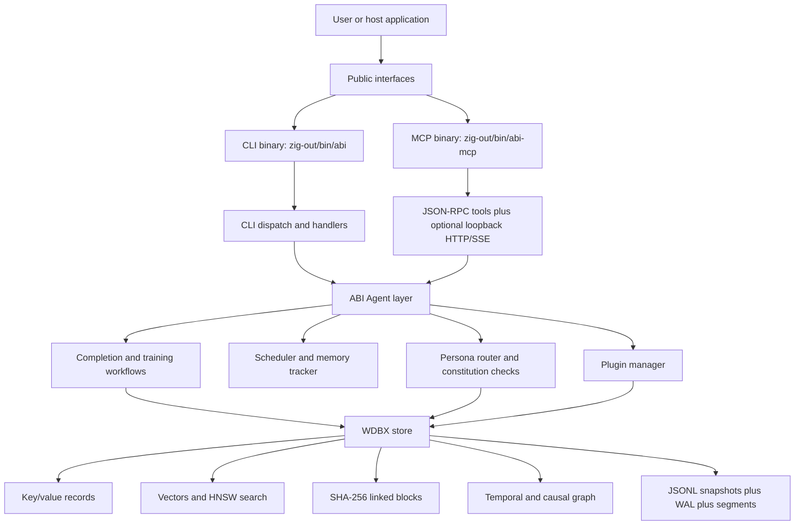
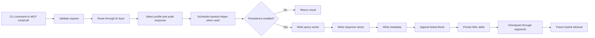

ABI is a local AI runtime with two tightly coupled layers:

- **ABI Agent layer**: routing, completion, training, scheduling, CLI/MCP exposure, plugins, connector boundaries, and constitution checks.
- **WDBX layer**: in-process key/value, vector, block, spatial, temporal/causal retrieval, snapshot/WAL/segment persistence, and reference-scoped runtime demos.

The useful mental model is: **ABI is the control plane; WDBX is the memory plane.** The agent layer decides how a request is routed, validated, scheduled, and optionally persisted. WDBX stores the records, vectors, metadata, linked blocks, and retrieval graph that make later local recall possible.

This page describes current repo-backed behavior. When this overview disagrees with `build.zig`, `src/`, `tests/contracts/`, or the build gates, the executable source wins.

## Layer Map



## Public Entry Points

The public API root is `src/root.zig`. The CLI starts in `src/main.zig` and dispatches through `src/cli/`, whose frozen top-level command list is asserted by contract tests. The MCP server lives in `src/mcp/` and exposes 12 contract-tested tools:

`ai_run`, `ai_complete`, `ai_train`, `ai_learn`, `wdbx_query`, `scheduler_stats`, `scheduler_info`, `connector_test`, `gpu_status`, `plugin_list`, `wdbx_stats`, `plugin_run`.

Both public surfaces intentionally stay small. CLI and MCP behavior is guarded by `tests/contracts/`, not by prose alone.

## Research Basis

This overview reconciles the implementation notes in `/Users/donaldfilimon/Downloads/deep-research-report.md` with the current checkout. The report's strongest framing is accurate for this repo: ABI is not only a chatbot wrapper, but a local orchestration layer over a memory substrate. The report also identified two points that this page preserves explicitly:

- WDBX durability is a snapshot + WAL + segment design, not only a JSONL dump.
- The block-chain path has snapshot/versioning behavior, but store-wide full MVCC visibility remains proposed work rather than a current production claim.

The report contained generated citation tokens from an external research environment. Those are intentionally omitted here. Use repo paths, tests, and validation commands as the evidence trail.

## Agent Layer

The agent layer primarily lives under `src/features/ai/`.

| Area | Source | Current role |
| --- | --- | --- |
| Public AI API | `src/features/ai/mod.zig` | Re-exported completion, training, model, routing, and store integration APIs. |
| Completion | `src/features/ai/completion.zig` | Validates input, resolves model aliases, selects a profile, audits output, and optionally writes to WDBX. |
| Router | `src/features/ai/router.zig` | Deterministic Abbey/Aviva/Abi keyword-weighted profile routing and adaptive weight persistence. |
| Constitution | `src/features/ai/constitution.zig` | Response governance with surfaced audit fields, including E-score and veto state. |
| Training | `src/features/ai/training.zig`, `training_support.zig` | Local profile training and dataset validation paths. |
| SEA loop | `src/features/sea/` | Evidence-aware learning path used by `complete --learn` and MCP `ai_learn`. |
| Scheduler | `src/core/scheduler.zig` | Local task coordination and memory tracker integration for agent helpers. |

The current implementation is local and explicit. Profile routing is deterministic. Live provider calls only cross explicit live-transport boundaries with credentials and requested live mode.

## WDBX Layer

WDBX primarily lives under `src/features/wdbx/`.

| Area | Source | Current role |
| --- | --- | --- |
| Store API | `src/features/wdbx/mod.zig` | In-process key/value, vector, block, spatial, stats, and retrieval entry points. |
| Vector search | `hnsw.zig`, `hnsw_distance.zig`, `hnsw_storage.zig` | HNSW-style cosine search with SIMD/GPU-vector-op fallback integration. |
| Hybrid retrieval | `retrieval.zig`, `temporal.zig` | HNSW semantic candidates re-ranked by temporal, causal, and persona factors. |
| Blocks | `chain.zig` | SHA-256-linked conversation blocks with snapshot iteration and verification. |
| Persistence | `persistence.zig`, `wal.zig`, `recovery.zig`, `segments.zig` | JSONL snapshots, CRC-framed WAL replay, recovery, and segment checkpoint retention. |
| Durable sessions | `durable_store.zig`, `src/cli/handlers/wdbx_db.zig` | Opens segment/WAL-backed stores for CLI/runtime use and checkpoints WAL deltas. |
| Runtime demos | `cluster.zig`, `cluster_rpc.zig`, `compute.zig`, `rest.zig`, `compression.zig`, `fhe.zig` | Repo-backed local or reference-scoped surfaces, not production claims. |

The hybrid ranking model is implemented as semantic search followed by:

```text
score = semantic * temporal * causal * persona
```

That means WDBX retrieval is not only "nearest vector wins." It can incorporate recency, causal edges, and persona weighting when callers provide the graph and persona context.

## Storage Primitives

WDBX is a composite in-process memory substrate, not just a vector index. The current repo-backed primitives are:

| Primitive | Main files | What it stores or computes | Current status |
| --- | --- | --- | --- |
| Key/value records | `src/features/wdbx/mod.zig` | Generic local records, metadata keys, and router/adaptive state. | Current |
| Vectors | `mod.zig`, `hnsw.zig`, `hnsw_storage.zig`, `hnsw_distance.zig` | Fixed-capacity padded vectors and HNSW-style cosine search. | Current |
| Conversation blocks | `chain.zig` | SHA-256-linked blocks with profile, query/response vector ids, metadata, snapshots, and verification. | Current |
| Temporal/causal graph | `temporal.zig`, `retrieval.zig` | Recency decay, causal proximity, and persona-weighted hybrid ranking. | Current |
| Spatial records | `spatial_3d.zig` | In-memory 3D records with distance search surfaces exposed through store stats/contracts. | Current |
| JSONL snapshots | `persistence.zig`, `persistence_parse.zig` | Checkpoint serialization and restoration with a trailing SHA-256 integrity line. | Current |
| WAL | `wal.zig` | CRC32-framed append-only mutation records with replay and corruption detection. | Current |
| Segment checkpoints | `segments.zig` | Manifest-backed immutable checkpoint epochs, latest-epoch loading, reset, and compaction. | Current |
| Recovery | `recovery.zig`, `durable_store.zig`, `src/cli/handlers/wdbx_db.zig` | Opens the latest checkpoint, folds WAL deltas forward, and checkpoints runtime mutations. | Current |
| Store-wide MVCC visibility | Broader future store layer | Full multi-version visibility beyond block snapshots and checkpoint epochs. | Proposed / incomplete |

The "MVCC" wording needs care. `chain.zig` exposes block snapshots and checkpointing provides versioned durable baselines, but `docs/spec/wdbx-north-star.mdx` still lists full MVCC visibility and cross-process/concurrent checkpoint coordination as gaps. Do not describe WDBX as a complete MVCC database.

## Durability And Recovery

Durability uses a layered snapshot + WAL + segment design:

1. `persistence.zig` serializes a JSONL snapshot beginning with the `# ABI-WDBX v1` header and ending with a checksum line. Deserialization rejects checksum mismatches.
2. `wal.zig` records supported mutations as framed records with CRC checks. WAL tests cover append/replay reconstruction and corrupt-frame rejection.
3. `segments.zig` checkpoints stores into immutable `<base>.seg.<epoch>.jsonl` files listed by `<base>.manifest`. It supports latest checkpoint loading, active epoch listing, reclaiming old epochs, and `compactRetainingLatest`.
4. `recovery.zig` and `durable_store.zig` combine the latest checkpoint with a sidecar WAL delta. CLI runtime commands recover WAL-ahead state before reading or writing.
5. `src/cli/handlers/wdbx_db.zig` exposes the durable path through `abi wdbx db init`, `verify`, `compact`, `block insert`, `block get`, and `query`.

Current CLI behavior prefers segment checkpoints as the runtime baseline and keeps the monolithic JSONL snapshot as a compatibility mirror for explicit-path tooling. `db verify` checks checkpoint integrity, block-chain validity, WAL frame integrity, and the merged checkpoint+WAL chain. `db compact <path> [keep]` retains the newest segment checkpoints without removing the latest recovery baseline or sidecar WAL.

## Persistence Contract

Completion persistence is opt-in. `CompletionRequest.store_result=true` is the switch that lets the completion path mutate a caller-provided WDBX store. When enabled, `completeWithStore()` records:

1. a query vector;
2. a response vector;
3. JSON completion metadata under `completion:<query_vector_id>`;
4. a linked conversation block with profile label, query vector id, response vector id, and metadata.

When `store_result=false`, completion returns without writing. When WDBX is compiled out or disabled, store-backed paths return explicit degraded behavior rather than fabricating persistence.

Training and learning paths follow the same memory-plane pattern. CLI training and MCP AI helpers use WDBX when the relevant features are enabled, while the SEA learning loop reuses `ai.completeWithStore` and adaptive routing rather than introducing a separate persistence system.

## End-to-End Workflow



The scheduler is local and observable. It coordinates task execution and memory tracking for CLI/MCP helper paths, but the repo does not prove a distributed scheduler. Distributed-adjacent work today is scoped to WDBX reference surfaces such as in-process Raft, loopback-tested cluster RPC, and remote-compute dispatch.

## Interface And Plugin Surface

The CLI command surface is frozen in `src/cli/usage.zig` and checked by `tests/contracts/surface.zig`. The top-level commands are:

`help`, `complete`, `train`, `agent`, `backends`, `plugin`, `auth`, `twilio`, `tui`, `dashboard`, `wdbx`, `scheduler`, `nn`.

The `wdbx` namespace currently covers:

```text
wdbx db init <path>
wdbx db verify <path>
wdbx db compact <path> [keep]
wdbx block insert <path> <profile> <metadata>
wdbx block get <path>
wdbx query <path> [text] [persona]
wdbx benchmark [count]
wdbx cluster <status|demo|serve <port> [node] [host]>
wdbx compute info
wdbx secure demo
wdbx gpu info
wdbx api serve [port]
```

The MCP surface is implemented in `src/mcp/handlers.zig` and uses JSON-RPC 2.0 over stdio plus optional loopback HTTP/SSE. Loopback HTTP/SSE can require `ABI_MCP_HTTP_TOKEN`; WDBX REST can require `ABI_WDBX_REST_TOKEN`. Those bearer tokens are local hardening only, not production non-loopback security.

Plugins are generated from `src/plugins/*/abi-plugin.json` by `tools/generate_plugin_registry.zig` into `src/plugin_registry.zig`. Do not hand-edit the generated registry. The plugin manager validates manifest metadata and keeps CLI/MCP plugin loading symmetric; `abi plugin list` and MCP `plugin_list` should agree on bundled plugin metadata.

## Source Map

| File or module | Role |
| --- | --- |
| `src/root.zig` | Public `abi` module re-export boundary. |
| `src/main.zig` | CLI entrypoint and `--tui` shortcut handling. |
| `src/cli/usage.zig`, `src/cli/registry.zig` | Frozen CLI command metadata and dispatch wiring. |
| `src/mcp/main.zig`, `src/mcp/handlers.zig`, `src/mcp/server.zig` | MCP runtime, tool catalog, stdio/loopback HTTP handling. |
| `src/features/mod.zig` | Comptime feature selector for real `mod.zig` vs disabled `stub.zig`. |
| `src/features/ai/completion.zig` | Completion, audit telemetry, scheduler/store integration, and metadata keys. |
| `src/features/ai/router.zig` | Abbey/Aviva/Abi routing and adaptive modulator state. |
| `src/features/sea/` | Evidence scoring, context packing, and learning loop. |
| `src/features/wdbx/mod.zig` | Main in-process store API. |
| `src/features/wdbx/retrieval.zig`, `temporal.zig` | Hybrid ranking and temporal/causal graph support. |
| `src/features/wdbx/persistence.zig`, `wal.zig`, `segments.zig`, `recovery.zig`, `durable_store.zig` | Durable storage and recovery path. |
| `tests/contracts/surface.zig`, `tests/contracts/mcp_tools.zig`, `tests/contracts/public_docs.zig` | Public surface, MCP, and claim-boundary contracts. |

## Feature Gates

The repository uses real/stub feature pairs selected by `-Dfeat-*` build options. Public feature API changes must preserve real/stub declaration parity and should be checked with:

```bash
zig build check-parity --summary all
```

The main local gate remains:

```bash
./build.sh check
```

That gate builds CLI and MCP binaries, runs module/connector/contract tests, exercises feature-off stubs, checks formatting, and validates parity.

## Claim Boundaries

WDBX currently supports in-process storage, segment/WAL persistence, hybrid retrieval, loopback MCP/REST surfaces, and tested reference-scoped runtime demos. Do not present ABI/WDBX as proving:

- production multi-host distributed deployment or sharding;
- production-ready non-loopback HTTP exposure without TLS/authz/rate-limit review;
- native local accelerator kernel execution for CUDA/Vulkan/Metal-kernel/ANE;
- production-secure or bootstrapped full FHE;
- production/SOTA learned compression;
- throughput, latency, accuracy, energy, or regulatory claims without a checked-in reproducible artifact.

Use `docs/contracts/external-claims-audit.mdx` and `docs/spec/wdbx-north-star.mdx` before reusing public wording.
