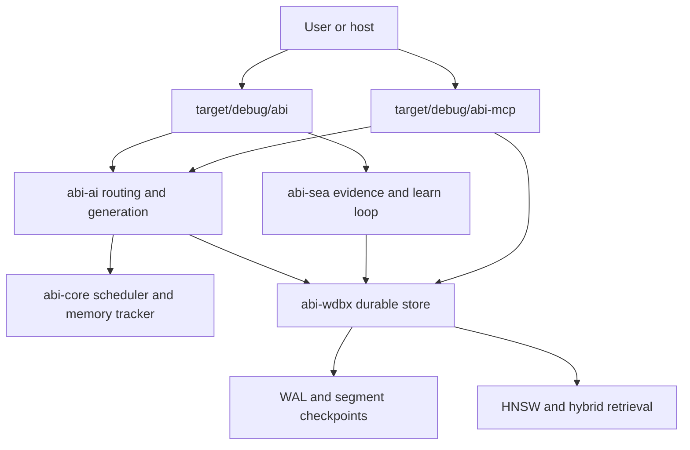

ABI is a nightly-Rust workspace. The agent layer is a local control plane for
deterministic routing, template generation, optional provider calls, and
evidence-aware completion. WDBX is the local memory plane for vectors,
key/value metadata, linked blocks, temporal and spatial records, snapshots,
WAL recovery, and bounded search.

<Note type="warning">
  Source wins. When this page disagrees with `Cargo.toml`, `crates/`,
  `tests/golden/`, or `./tools/check.sh`, trust the executable source and
  tests. Public claims remain governed by
  [External Claims Audit](../contracts/external-claims-audit).
</Note>

## Runtime map


```mermaid
flowchart TD
    U[User or host] --> CLI[target/debug/abi]
    U --> MCP[target/debug/abi-mcp]
    CLI --> AIR[abi-ai routing and generation]
    MCP --> AIR
    CLI --> SEA[abi-sea evidence and learn loop]
    AIR --> CORE[abi-core scheduler and memory tracker]
    AIR --> WDBX[abi-wdbx durable store]
    SEA --> WDBX
    MCP --> WDBX
    WDBX --> WAL[WAL and segment checkpoints]
    WDBX --> IDX[HNSW and hybrid retrieval]
```

Both binaries are local-first. MCP uses JSON-RPC over stdio and automatically
attempts a custom loopback HTTP compatibility listener. Its
one-event `/sse` response is not persistent MCP HTTP+SSE. WDBX REST and cluster RPC have their own
explicit bind, token, and claim boundaries.

## Ownership

| Layer | Source | Responsibility |
| --- | --- | --- |
| CLI | `crates/abi-cli/` | Frozen command dispatch, one-shot diagnostics, local completion, and WDBX operations |
| MCP | `crates/abi-mcp/` | Frozen tool dispatch, stdio JSON-RPC, and a best-effort custom loopback HTTP compatibility listener |
| AI | `crates/abi-ai/` | Profiles, deterministic routing, local templates, lexical constitution signal, model catalog, orchestration records |
| SEA | `crates/abi-sea/` | Query planning, evidence scoring/selection, bounded prompt augmentation, adaptive-router persistence |
| Core | `crates/abi-core/` | One-process scheduler, task accounting, registry, and memory tracking |
| WDBX | `crates/abi-wdbx/` | In-process storage, HNSW search, recovery, records, reference crypto/compression, local RPC demos |
| Connectors | `crates/abi-connectors/` | Explicit live/local provider transports and credential boundaries |

## Completion and evidence flow

The ordinary local path is:

1. `abi-ai` resolves an explicit leading profile selector or applies the
   deterministic keyword router.
2. The selected Abbey, Aviva, or ABI template formats the input locally.
3. The constitution module emits a bounded lexical policy signal. It is not a
   general safety classifier or proof that content is safe.
4. When a store is configured, the CLI attempts to persist query and response
   vectors, metadata, and a linked block.

`abi complete --learn` adds the SEA path:

1. `QueryPlan` classifies the local retrieval task.
2. `gather_evidence_with_plan` scores and selects bounded evidence from WDBX.
3. `augment_prompt` prepends the selected context within its byte budget.
4. The local completion runs and the adaptive router state is updated.

No credentials are required for either local path. Live Anthropic,
FoundationModels, and local OpenAI-compatible bridge paths cross separate
connector boundaries and must disclose the transport that actually generated
the output.

## WDBX storage path

`DurableStore` owns one writer session for a store path. Mutations append WAL
records; checkpoints publish immutable segment epochs through a manifest.
Recovery loads the newest valid checkpoint and folds matching WAL deltas
forward. The store supports:

- key/value records and completion metadata;
- vectors with exact and HNSW-style cosine search;
- SHA-256-linked blocks and verification;
- temporal, causal, persona, and spatial ranking components;
- bounded multiway rewriting experiments;
- compaction and checkpoint retention.

Tests must use `ABI_WDBX_PATH=:memory:`, `ABI_WDBX_PERSIST=0`, or a
counter-based scratch path. They must never open the operator's live
`~/.abi/` store.

## Scheduler and orchestration boundary

`abi-core::Scheduler` is a one-process task runner. It does not provide
durable jobs, remote workers, or multi-host execution.

The custom worker API in `abi-ai::orchestration` currently produces local
deterministic worker reports. Worker instructions and tool hints are metadata;
they do not execute tools. Any compatibility mode that prints scheduler task
IDs drains those tasks before the CLI exits and must not be described as a
durable background-agent system.

## Security and deployment boundary

- The automatically attempted custom MCP loopback HTTP compatibility listener
  and WDBX REST are loopback-oriented. The MCP `/sse` response is one event,
  not persistent conforming MCP HTTP+SSE. Bearer tokens are local hardening,
  not complete authorization or TLS.
- Cluster RPC is real TCP RequestVote/AppendEntries with optional token and
  peer allowlist controls. Production multi-host deployment and sharding are
  not proven.
- Compression and homomorphic-encryption surfaces are reference
  implementations unless a stronger audited artifact is explicitly cited.
- Metal acceleration is reported only when linked kernels initialize;
  CUDA/Vulkan/ANE execution is not implied by capability detection.

See [WDBX North-Star](./wdbx-north-star),
[Cluster mTLS Ops](./cluster-mtls-ops), and
[Non-loopback REST Threat Review](./non-loopback-rest-threat-review).

## Contracts and verification

The exact frozen command and MCP tool names live in
[Public API Contract](../contracts/public-api). Do not duplicate those lists in
architecture prose.

```bash
./tools/check.sh
.agents/skills/run-abi/smoke.sh
.agents/skills/sea-learn-loop/learn.sh
.agents/skills/wdbx-bench/bench.sh 50
```

When they pass, these commands provide local evidence for build, tests,
contract behavior, and representative runtime paths. They do not prove
public-internet hardening, distributed operation, model quality, or production
performance.
