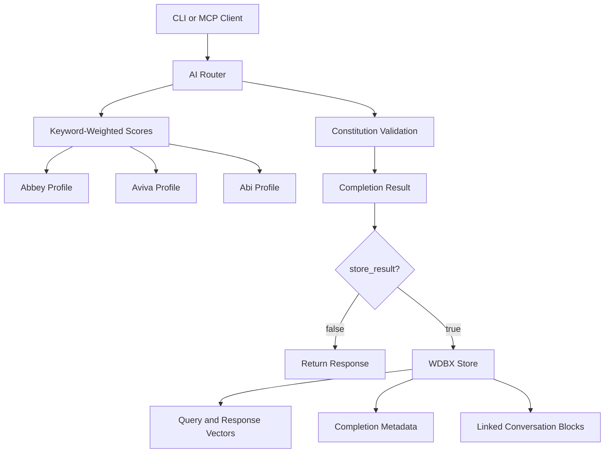

This document describes the current ABI multi-persona assistant implementation as supported by the repository source, contracts, and build gates. It intentionally avoids production benchmark, deployment, certification, or comparative model-quality claims unless they are backed by executable tests or checked-in artifacts.

## 1. Executive Summary

ABI is a Zig 0.17 local AI orchestration framework with three deterministic assistant profiles:

- **Abbey**: the primary empathetic-polymath profile, balancing warmth,
  creativity, explanation, and technical discipline.
- **Aviva**: the direct expert mode for concise, candid, action-oriented work.
- **ABI**: the adaptive orchestration/governance profile for intent, risk,
  context, policy, and response-mode evaluation.

The canonical product contract and its Current/Partial/Proposed evidence map are
in `docs/spec/abbey-core-identity.mdx`. Profile responses here remain local
deterministic templates; this role alignment is not a model-quality claim.

The current implementation provides:

- keyword-weighted profile routing with normalized Abbey/Aviva/Abi weights;
- optional exponential moving average smoothing for route weights persisted through a caller-provided WDBX store;
- constitution-style response validation against repository-defined principles;
- opt-in completion persistence into WDBX when `CompletionRequest.store_result=true`;
- scheduler-backed completion helper wiring for CLI/MCP completion paths;
- local multi-worker orchestration (`orchestration.zig`): `abi agent multi` (fixed trio), `spawn` (custom workers), and `browser` (dry-run plan; no embedded browser);
- CLI and MCP surfaces guarded by contract tests;
- feature-gated real/stub modules where disabled features preserve public symbols and return explicit degraded behavior.

## 2. Architecture



### Primary Source Modules

| Area | Source | Current role |
| --- | --- | --- |
| Public root | `src/root.zig` | Exposes the `abi` module namespace. |
| AI module | `src/features/ai/mod.zig` | Completion, training metadata acceptance, WDBX persistence integration, fixed-trio multi-agent entrypoint. |
| Orchestration | `src/features/ai/orchestration.zig` | Custom worker specs, background scheduler batch, browser local dry-run plan (`embedded_browser=false`). |
| AI router | `src/features/ai/router.zig` | Keyword-weighted routing, profile selection, optional EMA smoothing. |
| Constitution | `src/features/ai/constitution.zig` | Response validation against repository-defined principles. |
| WDBX | `src/features/wdbx/mod.zig` | In-process key/value, vector, block, spatial, and stats surfaces. |
| HNSW | `src/features/wdbx/hnsw.zig` | HNSW-style cosine search with SIMD path and GPU-vector-op fallback integration. |
| Persistence | `src/features/wdbx/persistence.zig` | JSONL snapshot serialize/restore with SHA-256 integrity and tamper rejection. |
| CLI | `src/cli/` | Frozen command surface and handlers. |
| MCP | `src/mcp/` | JSON-RPC 2.0 stdio and optional loopback HTTP/SSE tool surface. |

## 3. Persona Routing

Routing is deterministic and local. `src/features/ai/router.zig` starts with an
Abbey-primary prior (`0.40 / 0.30 / 0.30`) and adjusts it when keyword patterns
are found in the input. A neutral input therefore selects Abbey.

Current examples from the router keyword table include:

- Abbey-oriented terms include analytical, explanatory, creative, empathetic,
  learning, safety, and design cues.
- Aviva-oriented terms include `direct`, `concise`, `run`, `execute`, `deploy`,
  `build`, `fix`, and `quick`.
- ABI-oriented terms include `orchestrate`, `routing`, `governance`, `policy`,
  and `profile`.

The highest normalized score selects the profile:

```zig
pub fn selectBestProfile(weights_val: ProfileWeights) ai.AgentProfile {
    if (weights_val.w_abbey >= weights_val.w_aviva and weights_val.w_abbey >= weights_val.w_abi) {
        return .abbey;
    } else if (weights_val.w_aviva >= weights_val.w_abi) {
        return .aviva;
    } else {
        return .abi;
    }
}
```

Profile responses are currently deterministic local strings, not live network model calls.

## 4. Completion and Persistence Flow

`abi.features.ai.complete()` validates non-empty input, selects a profile, routes the input, and returns a `CompletionResult` containing:

- requested model label;
- selected profile;
- generated local output;
- constitution audit result;
- optional WDBX IDs when persistence is requested and succeeds.

`completeWithStore()` only mutates WDBX when `store_result=true`. `completeWithScheduler()` wraps the same completion-and-store behavior in a high-priority scheduler task for callers that own a scheduler. In the storage path it records:

1. a query vector;
2. a response vector;
3. JSON completion metadata under `completion:<query_vector_id>`;
4. a linked conversation block with the selected profile label and vector IDs.

The metadata labels generated completions as `authority=inferred` and
`epistemic_status=generated_output`, records that persistence came from the
explicit `store_result` switch, and omits raw prompt/response text. SEA recall
uses explicit authority as a trust-weighted ranking signal and defaults missing
or unknown authority to `inferred` rather than promoting it.

When WDBX is disabled, storage paths return explicit disabled-feature behavior rather than fabricating persistence success.

## 5. WDBX Substrate

WDBX is currently an in-process store. Repo-backed capabilities include:

- key/value storage;
- fixed-capacity padded vector storage;
- HNSW-style vector search with ordered result contracts;
- SHA-256-linked conversation blocks with snapshot iteration and integrity verification;
- in-memory 3D spatial records and distance searches;
- JSONL snapshot persistence (`persistence.zig`) with a SHA-256 integrity line, faithful id/timestamp/hash restore, and clean rejection of tampered or out-of-range records;
- store stats and acceleration status reporting;
- disabled-feature stubs that preserve public shape and return explicit disabled errors for write/search paths.

WDBX is not currently documented here as a distributed database, sharded service, Redis/FAISS deployment, or externally benchmarked production vector database.

## 6. CLI and MCP Surfaces

### CLI

The frozen top-level CLI commands are:

- `help`
- `complete`
- `train`
- `agent`
- `backends`
- `plugin`
- `auth`
- `twilio`
- `tui`
- `dashboard`
- `wdbx`
- `scheduler`
- `nn`

The `abi --tui` shortcut is handled separately by `src/main.zig`. `abi scheduler status` is a one-shot scheduler probe, and `abi nn` is a miniature char-level demo trainer, not a production LLM or distributed training surface. `abi wdbx` is a WDBX runtime control surface (snapshot/WAL `db`/`block`/`query`, local `benchmark`, `gpu` info, and honest in-process `cluster`/`compute`/`secure` demonstrations); it does not introduce distributed, native-accelerator, or production-database claims (see `docs/spec/wdbx-north-star.mdx`).

### MCP

The MCP server exposes JSON-RPC 2.0 over stdio with optional loopback HTTP/SSE. Contract-tested tools are:

- `ai_run`
- `ai_complete`
- `ai_learn`
- `ai_train`
- `wdbx_query`
- `scheduler_stats`
- `scheduler_info`
- `connector_test`
- `gpu_status`
- `plugin_list`
- `wdbx_stats`
- `plugin_run`

Feature-backed tools return explicit degraded responses when their feature is disabled.

## 7. Feature Gates and Stubs

Every feature under `src/features/` has a real `mod.zig` and disabled `stub.zig` selected at compile time through `build_options`. Public feature API changes must update both files.

The primary gates are:

```bash
./build.sh check
./build.sh full-check
zig build check-parity
```

`./build.sh check` includes feature-off smoke builds, focused feature contract tests, public contract tests, formatting, CLI/MCP builds, and parity checks.

## 8. Performance and Benchmark Policy

ABI includes benchmark targets and integration tests, but this document does not publish production latency, throughput, availability, cache-hit, GPU-utilization, model-quality, or comparative model benchmark numbers. Publish those only when a reproducible benchmark artifact or contract is checked into the repository and cited.

Safe current wording:

> ABI provides local deterministic AI profile routing, an in-process WDBX vector/key-value/block store, contract-tested CLI/MCP surfaces, feature-off stubs, and GPU capability reporting with deterministic CPU fallback.

## 9. Deployment Boundary

The repository builds local CLI and MCP binaries. It does not currently prove a specific cloud, cluster, accelerator fleet, regulatory certification, or production service-level objective. Deployment documents should therefore describe such items as proposals or environment-specific requirements, not current repository-backed ABI capabilities.

## 10. Validation Checklist for Documentation Changes

Before publishing technical collateral based on ABI, verify that it does not assert unsupported claims about:

- distributed sharding;
- storage encryption or RBAC guarantees;
- Python/TensorFlow/PyTorch implementation stacks;
- Kubernetes, H100/A100, or multi-node deployments;
- regulatory certifications;
- production QPS, latency, availability, accuracy, cache-hit, utilization, or energy metrics;
- comparative model benchmark scores.

Use `docs/contracts/external-claims-audit.mdx` and `docs/contracts/public-api.mdx` as the public claim boundary.
